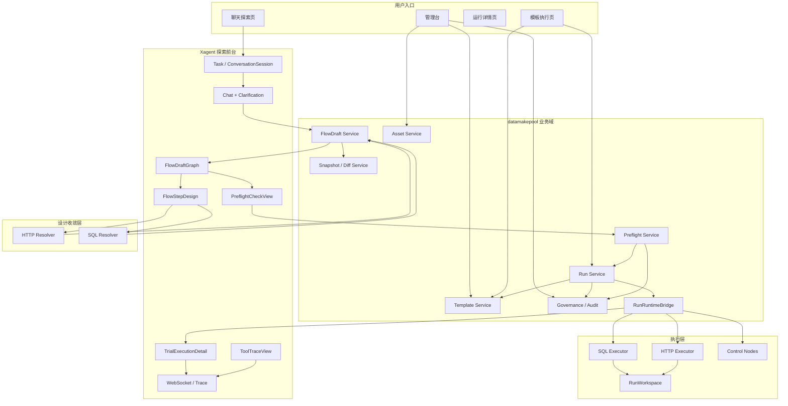

# 智能造数平台架构文档 V1

## 1. 文档目标

本文档基于当前整理后的需求与设计结论，给出智能造数平台 V1 的系统架构说明。

本文档重点说明：

- 系统目前现状
- 平台推荐架构
- 核心层次划分
- 数据流转路径
- 关键处理流程
- 与现有 Xagent 底座的关系

## 2. 系统目前现状

### 2.1 Xagent 已有能力

当前 Xagent 代码库已经具备：

- 用户和登录体系
- Task 模型
- DAGExecution 与 TraceEvent
- WebSocket 过程回显
- DAG 可视化前端
- 工具体系
- Workspace 管理
- 聊天历史与恢复机制

这些能力说明：

- Xagent 已经非常适合作为探索前台和运行时平台壳

### 2.2 当前缺失能力

当前还没有真正落地的，是智能造数平台业务内核：

- 统一业务 DAG 模型
- FlowDraft 中心
- HTTP / SQL 资产中心
- SQL 资产审核后生效机制
- 模板草稿、模板版本、审核发布
- 正式 Run 中心
- SQL 风险确认与审计
- 与平台权限模型一致的后台管理台

因此当前的架构结论是：

- Xagent 底座可复用
- datamakepool 业务域必须独立建设

## 3. V1 推荐架构

### 3.1 架构总览



### 3.2 核心架构原则

#### 原则 1：Xagent 负责探索前台

Xagent 继续承担：

- 聊天澄清
- 探索态交互
- DAG 图形展示
- 过程回显

#### 原则 2：datamakepool 负责业务内核

datamakepool 承担：

- FlowDraft
- 资产
- 模板
- Run
- SQL 治理
- 审计

#### 原则 3：主 DAG 是业务 DAG

平台主图不是工具调用图，而是：

- 业务意图图
- 技术实现图

#### 原则 4：设计层与执行层分离

- Resolver 收敛步骤方案
- Executor 只按已收敛方案执行

#### 原则 5：Task 与 Run 分层宿主

- `Task` 是探索态宿主
- `Run` 是执行态宿主
- V1 通过 `RunRuntimeBridge` 连接两者

## 4. 核心对象关系

### 4.1 对象分层

| 层次 | 对象 | 作用 |
|---|---|---|
| 探索前台 | `Task` | 聊天探索会话宿主 |
| 探索前台 | `FlowDraft` | 统一业务 DAG 草案 |
| 平台能力层 | `Asset` | 提供 HTTP / SQL 能力 |
| 模板层 | `Template` / `TemplateRevision` | 保存可重复执行方案 |
| 执行层 | `Run` / `RunStep` | 记录某次正式执行 |
| 治理层 | `AuditRecord` | 风险、确认、审计 |

### 4.2 Task 与 Run

#### `Task`

用于承载：

- chat messages
- DAGExecution
- TraceEvent
- TaskWorkspace
- 当前 FlowDraft 引用

#### `Run`

用于承载：

- RunStep
- 执行状态
- 确认记录
- 审计
- 运行详情

两者通过 `RunRuntimeBridge` 连接。

### 4.3 FlowDraft 与 TemplateRevision

- `FlowDraft` 是探索态对象
- `TemplateRevision` 是沉淀后的可重复执行对象

模板草稿从试跑成功的 `FlowDraft` 收敛结果自动生成。

### 4.4 Asset 与 TemplateRevision

- Asset 提供能力
- TemplateRevision 不复制资产本体
- TemplateRevision 保存：
  - 资产引用
  - 如何调用资产的固化方案

## 5. 分层 DAG 与五层视图

### 5.1 两层 DAG

#### `business_graph`

给用户理解流程，表达：

- 业务步骤
- 依赖关系
- 关键输入输出摘要
- 风险和确认标记

#### `technical_graph`

给系统执行，表达：

- `http_step`
- `sql_step`
- `confirm`
- `mapping`
- `start`
- `end`

以及它们之间的技术依赖。

### 5.2 五层视图

平台前台分成五层视图：

1. `FlowDraftGraph`
2. `FlowStepDesign`
3. `PreflightCheckView`
4. `TrialExecutionDetail`
5. `ToolTraceView`

它们分别解决：

- 看懂整体流程
- 看懂单步设计
- 看懂为什么不能试跑
- 看懂实际发生了什么
- 看懂底层调试细节

## 6. 数据流转

### 6.1 聊天探索数据流

```text
用户输入
  ↓
Xagent Chat / Clarification
  ↓
生成初版 FlowDraft
  ↓
展示 business_graph + pending_issues
  ↓
用户修正
  ↓
Resolver 重新收敛 technical_graph
  ↓
更新 FlowDraft / Snapshot / Diff
```

### 6.2 试跑数据流

```text
FlowDraft
  ↓
Preflight 检查
  ↓
无阻塞项后创建 Run
  ↓
RunRuntimeBridge 建立 task/run 映射
  ↓
按 RunStep 调用 HTTP / SQL Executor
  ↓
写入 RunStep 快照 / AuditRecord / 运行产物
  ↓
通过 WebSocket 回显到 TrialExecutionDetail
```

### 6.3 模板沉淀数据流

```text
试跑成功
  ↓
回写 resolved_execution_plan
  ↓
固化 resolution_rationale
  ↓
生成 TemplateRevision 草稿
  ↓
提交审核
  ↓
发布
```

### 6.4 模板执行数据流

```text
用户选择已发布模板
  ↓
填写 input_schema 对应表单
  ↓
创建 Run
  ↓
按 TemplateRevision 中固化的 technical_graph 执行
  ↓
写 RunStep / 审计 / 输出
```

## 7. 关键处理流程

### 7.1 聊天探索主流程

```text
用户自然语言描述需求
  ↓
系统澄清需求
  ↓
整体生成初版 FlowDraft
  ↓
默认展示业务意图图 + 待确认项
  ↓
按问题类型推荐修正路径
  ↓
局部或全量重收敛
  ↓
形成可试跑 FlowDraft
```

### 7.2 预检流程

预检负责判断：

- 是否存在 `route_pending`
- 是否存在 `asset_pending`
- 是否存在 `param_pending`
- 是否存在 `governance_blocked`
- 是否存在依赖或映射缺失

只要存在阻塞项，就不能进入试跑。

### 7.3 Resolver / Executor 流程

#### HTTP 流程

```text
design_intent
  ↓
HTTP Resolver
  ↓
resolution_rationale + resolved_execution_plan
  ↓
HTTP Executor
  ↓
request_snapshot / response_snapshot / extracted_outputs
```

#### SQL 流程

```text
design_intent
  ↓
SQL Resolver
  ↓
lane / risk / resolved_execution_plan
  ↓
SQL Executor
  ↓
sql_snapshot / result_snapshot / audit_payload
```

### 7.4 审核与生效流程

#### SQL 资产

```text
用户创建或修改 SQL 资产
  ↓
形成草稿版本
  ↓
提交审核
  ↓
domain_admin / system_admin 审核
  ↓
通过后切换 current active version
```

#### 模板

```text
FlowDraft 试跑成功
  ↓
生成 TemplateRevision 草稿
  ↓
提交审核
  ↓
domain_admin / system_admin 审核
  ↓
发布
```

## 8. 关键集成风险与处理策略

### 8.1 Task / Run 双宿主风险

处理策略：

- V1 采用分层宿主
- 不一步到位改底层为全面双宿主

### 8.2 Trace / WebSocket 风险

处理策略：

- 存储层先保留 task-centric
- 消息与聚合层引入 run_id

### 8.3 Workspace 污染风险

处理策略：

- 探索态使用 `TaskWorkspace`
- 执行态使用独立 `RunWorkspace`

### 8.4 资产版本竞态风险

处理策略：

- 在 Run 创建时锁定资产版本快照
- RunStep 保存执行方案快照

### 8.5 事务一致性风险

处理策略：

- 模板草稿生成事务化
- SQL 资产审核切换事务化
- Run 初始化事务化

## 9. 架构总结

一句话总结：

智能造数平台 V1 采用“Xagent 探索前台 + datamakepool 业务内核”的双层架构，
通过 FlowDraft 统一业务 DAG、通过 Resolver / Executor 分离设计与执行、通过 Run 承接正式执行与审计、通过 TemplateRevision 承接可重复执行方案，从而形成完整的探索、试跑、沉淀、发布和复用闭环。
