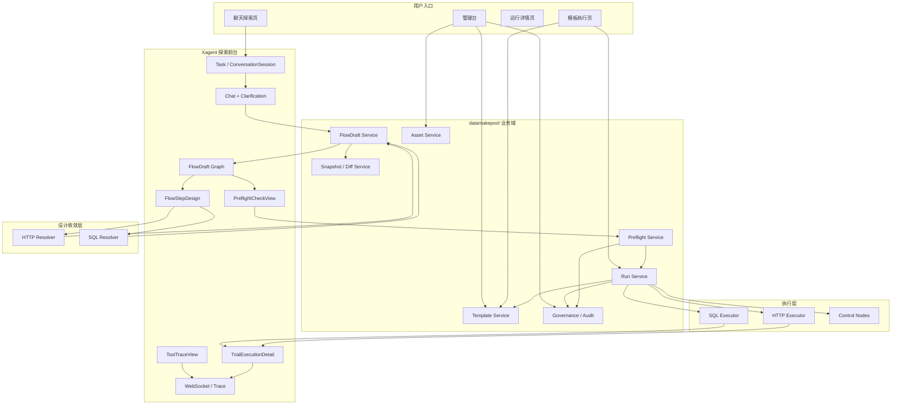

# 2026-03-24 基于 Xagent 的统一造数平台详细设计

## 1. 文档范围

本文档基于以下文档继续展开：

- [xagent20260324.md](/D:/code/xagent/spec/xagent20260324.md)
- [xagent-implementation20260324.md](/D:/code/xagent/spec/xagent-implementation20260324.md)
- [plan20260324.md](/D:/code/xagent/spec/plan20260324.md)

本文档重点明确：

- 权限与审核模型如何在 `Xagent + datamakepool` 方案中落地
- 探索前台、业务 DAG、试跑、模板沉淀、发布、安全门如何串联
- `FlowDraft`、`Asset`、`TemplateRevision`、`Run`、`AuditRecord` 的详细技术模型
- 五层视图、分层 DAG、预检、重收敛、Resolver / Executor 的系统设计
- API 与持久化模型建议

本文档不负责：

- 详细任务拆解
- 排期
- 发布排程

这些内容由 [task20260324.md](/D:/code/xagent/spec/task20260324.md) 承担。

## 2. 设计前提

### 2.1 平台本质

统一造数平台不是通用 Agent 平台，也不是后台配置系统。

它本质上是：

```text
聊天澄清需求
  ↓
生成业务 DAG 草案
  ↓
受控试跑
  ↓
沉淀模板草稿
  ↓
审核发布
  ↓
标准化重复执行
```

### 2.2 Xagent 的定位

在这套方案中：

- `Xagent` 负责探索前台
- `datamakepool` 负责业务内核

更具体地说：

- `Xagent`
  - 聊天澄清
  - 交互式修正
  - DAG 展示
  - 试跑过程回显
- `datamakepool`
  - 统一业务 DAG
  - 资产中心
  - 预检
  - 试跑
  - 模板草稿与版本
  - SQL 治理与审计

### 2.3 核心原则

必须坚持：

- 主 DAG 是业务 DAG，不是工具调用 DAG
- 聊天、试跑、模板共用同一种业务 DAG 模型
- Resolver 负责设计收敛，Executor 负责按方案执行
- 模板发布是正式安全门
- 已发布模板按固化方案执行

## 3. 权限、审核与 `systemShort` 设计

这一部分属于已澄清的核心权限约束，必须保留。

### 3.1 角色模型

V1 固定三类角色：

- `system_admin`
- `domain_admin`
- `user`

在现有 `Xagent` 用户体系上建议映射为：

- 系统管理员
  - 继续复用 `users.is_admin = true`
- 普通管理员
  - 新增 `admin_system_scopes`
  - 一个用户可绑定多个 `systemShort`
- 普通用户
  - 不属于以上两类

### 3.2 `systemShort`

`systemShort` 是对象归属与审核路由字段，不是普通用户的使用隔离字段。

规则：

- SQL 资产必须带 `system_short`
- 模板必须带主 `system_short`
- HTTP 资产建议也带 `system_short`
- 普通管理员按 `system_short` 查看和审核对象
- 普通用户不按 `system_short` 限制使用范围

### 3.3 普通管理员权限

在自己负责的 `systemShort` 范围内，普通管理员可以：

- 查看全部相关资产
- 查看全部相关模板
- 查看相关 Run
- 审核 SQL 资产
- 审核模板发布
- 自审自己提交的对象

但不能：

- 直接修改别人创建的对象

### 3.3.1 `admin_system_scopes` 实体建议

为落地普通管理员多 scope 绑定，建议新增：

- `admin_system_scopes`

建议字段：

- `id`
- `user_id`
- `system_short`
- `created_at`

建议约束：

- `(user_id, system_short)` 唯一

它的作用是：

- 将普通管理员与多个 `systemShort` 建立显式绑定
- 为审核路由和对象级查询过滤提供基础数据

### 3.4 用户权限

普通用户可以：

- 创建、修改自己的 HTTP 资产
- 创建、修改自己的 SQL 资产草稿版本
- 创建、修改自己的模板草稿
- 发起聊天探索
- 发起试跑
- 执行已发布模板
- 只查看自己发起的 Run

### 3.5 SQL 资产审核与生效

SQL 资产属于高风险资产，必须保留审核后生效设计。

规则：

- 所有 SQL 资产新增/修改都要审核
- 用户创建 SQL 资产时先形成草稿版本
- 草稿和待审核版本都可以测试
- 待审核版本对全员可见，但不可正式使用
- 对应 `systemShort` 的普通管理员或系统管理员审核通过后，成为当前生效版本
- 若当前已有生效版本，则审核通过前继续由旧生效版本承担正式执行

### 3.6 模板审核与发布

模板发布是正式安全门。

规则：

- 模板带主 `systemShort`
- 模板可以跨系统引用资产
- 模板审核只按模板主 `systemShort` 路由
- 待审核模板对全员可见，但不可执行
- 对应 `systemShort` 的普通管理员或系统管理员审核通过后发布

### 3.7 Run 查看范围

| 角色 | Run 查看范围 |
|---|---|
| 系统管理员 | 全量 Run |
| 普通管理员 | 自己负责 `systemShort` 下的相关 Run |
| 用户 | 仅自己发起的 Run |

补充规则：

- 模板创建者不能查看别人执行自己模板产生的完整 Run
- 模板页可展示聚合信息，但不等于可看完整运行详情

### 3.8 审计可见性

审计页只对系统管理员开放。

系统必须完整记录：

- 谁发起执行
- 来自聊天还是模板页
- 哪个 Run
- 哪个步骤
- 调用了哪个 SQL 资产 / SQL 资产版本
- 实际执行了什么 SQL
- 是否确认
- 最终状态

### 3.9 鉴权执行层级

基于 `systemShort` 的对象级越权拦截不建议写在 API 层。

建议分层如下：

#### Middleware / Dependency

负责：

- 用户认证
- 装载用户身份
- 装载系统管理员 / 普通管理员 / 普通用户角色
- 装载普通管理员可用 `systemShort` 列表

#### datamakepool Service / Repository

负责：

- 对象级过滤
- 查询范围收缩
- 越权拦截
- 审核路由判断

#### API 层

只负责：

- 参数解析
- service 调用
- 响应返回

不承载复杂业务鉴权逻辑。

## 4. 总体架构



架构核心：

- `Task` 只承担探索会话容器
- `FlowDraft` 是探索态核心对象
- `Run` 是平台正式执行对象
- Resolver / Executor 分层
- 管理台、模板页、运行页都围绕 `datamakepool` 业务对象展开

## 5. 核心对象设计

### 5.1 `Task` 适配为 `ConversationSession`

建议复用 `Xagent` 现有 `Task` 作为探索会话容器，而不是直接拿它当平台最终 Run。

`Task` 在统一造数平台中的定位：

- 承载聊天消息
- 承载当前 `FlowDraft` 引用
- 承载探索态上下文
- 承载试跑入口的前台会话信息

`Task` 不应直接承担：

- 平台正式审计对象
- 已发布模板执行对象

### 5.2 `FlowDraft`

`FlowDraft` 是探索态核心对象。

建议最小字段：

- `id`
- `task_id`
- `status`
- `title`
- `objective`
- `business_graph_payload`
- `technical_graph_payload`
- `pending_issues_payload`
- `preflight_summary_payload`
- `input_schema_draft`
- `output_mapping_draft`
- `latest_snapshot_id`
- `created_by`
- `created_at`
- `updated_at`

### 5.3 `FlowDraftSnapshot`

探索态必须保留关键版本快照。

建议新增：

- `id`
- `flow_draft_id`
- `snapshot_type`
  - `initial_draft`
  - `re_resolved`
  - `pre_trial`
  - `trial_success`
- `business_graph_snapshot`
- `technical_graph_snapshot`
- `preflight_summary_snapshot`
- `created_by`
- `created_at`

### 5.4 `Asset`

平台能力资源对象。

V1 至少包含：

- `HttpAsset`
- `SqlAsset`
- `SqlAssetVersion`

其中：

- HTTP 资产直接生效
- SQL 资产通过版本和审核后生效

### 5.5 `Template` 与 `TemplateRevision`

模板必须拆成两层：

- `Template`
- `TemplateRevision`

否则无法承接：

- 草稿
- 待审核
- 已发布版本
- 历史版本

### 5.6 `Run`

`Run` 是平台正式执行对象。

聊天和模板页一旦进入正式执行，都必须创建 `Run`。

这意味着：

- `Task` 管探索会话
- `Run` 管正式执行

### 5.7 `AuditRecord`

审计与治理对象。

至少覆盖：

- 风险判定
- 用户确认
- SQL 审计
- 执行结果

### 5.8 `Task` 与 `Run` 的分层宿主设计

这里必须明确一个关键技术判断：

- `Task` 和 `Run` 在业务语义上都是一等对象
- 但在 V1 实现上，不建议一步到位把底层 runtime 改成全面双宿主

建议采用：

```text
业务上双宿主
基础设施上分层宿主
```

#### `Task` 的定位

`Task` 继续承担探索态 runtime 宿主。

它负责承载：

- 聊天消息
- 当前 `FlowDraft` 引用
- `DAGExecution`
- `TraceEvent`
- `TaskWorkspace`
- WebSocket 会话与探索态过程回显

#### `Run` 的定位

`Run` 承担执行态业务宿主。

它负责承载：

- 正式执行状态
- `RunStep`
- SQL 审计
- 用户确认
- 运行详情页
- 模板执行入口的正式语义

#### 为什么不只保留 `Task`

因为 `Run` 已经不是一个普通业务表，而是独立承载：

- 正式执行
- 审计
- 确认
- 运行详情
- 模板执行

如果继续把这些全部挂回 `Task`，
就会再次把探索态和执行态混在一起。

#### 为什么不一步到位做全面双宿主

因为当前底层实现明显 task-centric：

- `TraceEvent` 强绑定 `task_id`
- `DAGExecution` 强绑定 `task_id`
- WebSocket 连接与广播按 `task_id` 组织
- Workspace 和文件注册逻辑按 task/workspace id 组织

因此一步到位改成真正 `task_id/run_id` 双宿主会导致底层改造面过大。

#### V1 推荐方案：`RunRuntimeBridge`

V1 建议新增桥接层：

- `RunRuntimeBridge`

它负责把探索态 runtime 与执行态业务对象连接起来。

桥接层至少承担：

- `task_id <-> run_id` 映射
- 从执行过程投影出 `RunStep`
- 将关键 trace 聚合到 `Run`
- 将确认、审计与正式执行结果挂到 `Run`
- 管理执行产物与 `Run` 的关联关系

#### V1 落地原则

V1 推荐这样处理：

- 探索态继续依附 `Task`
- 一旦进入试跑或模板执行，必须创建 `Run`
- 底层 agent runtime 可以先继续运行在 task-centric 机制上
- 平台正式运行视图、审计视图、权限视图全部围绕 `Run`

也就是说：

- `Task` 是探索态宿主
- `Run` 是执行态宿主
- 二者通过桥接层连接

#### `DAGExecution` 的范围

`DAGExecution` 在 V1 不建议继续承担正式执行态真相源。

建议范围收缩为：

- 只保留探索态用途
- 用于承载聊天探索过程中的 DAG 展示与过程状态

正式执行态的真相源改为：

- `Run`
- `RunStep`

因此设计上不写“立即废弃 `DAGExecution`”，
而写：

- V1 保留探索态
- 执行态迁移到 `Run`
- 后续再评估是否进一步收缩或迁移底层实现

#### Trace 与 WebSocket 策略

V1 不建议一步到位把 trace 存储层改成真正 task/run 双宿主。

建议采取分阶段策略：

- 存储层暂时仍以 `task_id` 通道为主
- 运行态聚合层和消息体引入 `run_id`
- `RunRuntimeBridge` 负责把探索态 trace 聚合成执行态 run 视图
- 前端运行详情页围绕 `run_id` 读取聚合结果

也就是说：

- V1：消息与聚合双标识
- V2：再评估 `TraceEvent` 存储层双宿主化

#### Workspace 隔离策略

必须区分：

- `TaskWorkspace`
- `RunWorkspace`

规则：

- `TaskWorkspace` 仅用于探索态
- 每个 `Run` 拥有独立 `RunWorkspace`
- 试跑 Run 和模板正式执行 Run 都不能继续混用原探索 workspace

桥接层应负责：

- 将探索态已确认输入迁移或挂载到 `RunWorkspace`
- 将执行产物按 `run_id` 归档

这意味着文件与产物的正式归属，不应再只依赖 `task_id`。

### 5.9 最终 DAG 图定义

这里必须明确区分“给用户看的图”和“给系统执行的图”。

#### 给用户看的最终图

给用户看的最终主图是：

- `business_graph`

它用于表达：

- 流程一共分几步
- 每一步业务上在做什么
- 步骤之间如何依赖
- 哪些步骤存在风险或需要确认
- 整体流程是否符合用户预期

它不直接承载可执行细节。

#### 给系统执行的最终图

给系统执行的最终图是：

- `technical_graph`

它用于表达：

- 哪些节点是 `http_step`
- 哪些节点是 `sql_step`
- 哪些节点是 `confirm / mapping / start / end`
- 各技术节点之间的依赖关系

它才是模板沉淀和重复执行的主骨架。

#### 不是最终图的内容

以下内容不应被误认为平台最终 DAG：

- 工具调用 DAG
- resolver / executor 内部 agent 的推理轨迹
- tool trace

这些只能作为下钻调试信息存在。

### 5.10 可重复执行单元定义

平台最终可重复执行的，不是单独某个资产，也不是业务意图图本身，
而是：

```text
technical_graph 中的技术节点
  +
每个节点固化后的 resolved_execution_plan
```

也就是说，真正的重复执行单元是：

- 一个技术执行节点
- 加上它在试跑成功后收敛并固化下来的具体执行方案

#### `http_step` 的可重复执行内容

至少包括：

- 已选 HTTP 资产
- 参数模板
- 参数来源标注
- 默认值与默认值来源
- 请求渲染结果结构
- 提取规则
- 输出映射
- 运行配置

#### `sql_step` 的可重复执行内容

至少包括：

- 已选 SQL 资产
- SQL 模板 / 查询方案
- 参数模板
- 输出字段
- `sql_lane`
- 风险判断结果
- 命中对象
- 确认策略
- 参考依据绑定
- 允许变动边界
- 执行配置

### 5.11 `TemplateRevision` 到底保存什么

`TemplateRevision` 不只是保存一张流程图，
而是保存一份“可重复执行的完整版本化流程”。

因此模板版本至少需要承接：

- 当前 `technical_graph`
- 当前 `input_schema`
- 当前 `output_mapping`
- 每个步骤的：
  - `design_intent`
  - `resolution_rationale`
  - `resolved_execution_plan`

换句话说：

- `business_graph` 用于用户理解与探索阶段展示
- `technical_graph + resolved_execution_plan` 用于模板沉淀与后续重复执行

### 5.12 资产、模板、Run 三者的关系

三者关系必须理解清楚：

#### `Asset`

`Asset` 提供能力资源：

- HTTP 接口能力
- SQL 数据源能力

资产本身不直接等于业务流程。

#### `TemplateRevision`

`TemplateRevision` 保存的是：

- 技术执行 DAG
- 对资产的引用关系
- 如何使用这些资产的具体执行方案

模板不是复制资产，而是：

- 引用资产
- 固化“如何调用资产”

#### `Run`

`Run` 保存的是某次实际执行。

它不负责定义模板本身，
而负责记录：

- 这次执行用了哪份模板版本
- 这次执行时每步的 `resolved_execution_plan_snapshot`
- 当次输入、输出、错误、审计和确认结果

因此三者关系可以概括为：

```text
Asset = 提供能力
TemplateRevision = 保存可重复执行方案
Run = 记录某次实际执行快照
```

### 5.13 `business_graph` 的持久化语义

`business_graph` 不应只作为运行时派生内容存在。

建议：

- `FlowDraft` 中保存 `business_graph`
- `FlowDraftSnapshot` 中保存 `business_graph_snapshot`
- `TemplateRevision` 中也保存 `business_graph_snapshot`

这样做的目的：

- 支撑用户理解
- 支撑审核展示
- 支撑版本 diff

而不必每次都只从 `technical_graph` 派生。

## 6. 分层 DAG 与五层视图

### 6.1 业务 DAG 不等于工具调用 DAG

这里必须明确：

- `Xagent` 当前默认暴露出来的 DAG，更接近步骤内部工具使用视图
- 这不应直接成为平台的主 DAG

平台主 DAG 应表达：

- 业务动作
- 技术执行单元
- 依赖关系
- 关键输入输出
- 风险或确认要求

工具调用链只能作为下钻调试视图。

### 6.2 两层图结构

`FlowDraft` 必须同时承载两层图：

#### `business_graph`

面向主图，表达：

- 业务意图节点
- 业务依赖关系
- 节点摘要

#### `technical_graph`

面向技术实现图，表达：

- `http_step`
- `sql_step`
- `confirm`
- `mapping`
- `start`
- `end`

### 6.3 五层视图

平台前台必须明确区分五层视图：

1. `FlowDraftGraph`
   - 聊天探索页主图
2. `FlowStepDesign`
   - 节点设计详情
3. `PreflightCheckView`
   - 试跑前收敛检查
4. `TrialExecutionDetail`
   - 试跑 / 运行详情
5. `ToolTraceView`
   - 调试 trace 视图

### 6.4 `FlowDraftGraph`

默认展示：

- 业务意图图

允许切换：

- 技术实现图

规则：

- 简单场景一个业务节点对应一个技术节点
- 复杂场景一个业务节点可展开为多个技术节点

### 6.5 `FlowStepDesign`

节点详情展示优先级固定为：

1. 资产与参数
2. 执行语句与提取规则
3. 风险与影响

### 6.6 `PreflightCheckView`

预检视图必须支持：

- 按问题类型分组
- 按步骤分组
- 默认先按问题类型分组
- 推荐修正路径

### 6.7 `TrialExecutionDetail`

试跑详情应支持：

- 整体试跑概览
- 单步执行详情

### 6.8 `ToolTraceView`

仅面向：

- 研发
- 排障
- 高级管理员

不能成为：

- 业务用户默认主图
- 模板审核主图

## 7. 探索态交互与重收敛

### 7.1 初版生成

聊天探索阶段采用：

- 先整体生成一版初始 `FlowDraft`
- 再围绕这版草案逐步修正

### 7.2 初版默认展示

初版 `FlowDraft` 生成后，系统最先应展示：

- 业务意图图
- 待确认项清单

### 7.3 待确认项默认修正路径

两条都支持：

- 回聊天修正
- 去节点详情修正

默认推荐规则：

- 需要重新思考方案的问题
  - 走聊天修正
- 结构化配置补全的问题
  - 走节点详情修正

### 7.4 局部重收敛与全量重收敛

支持：

- 局部重收敛
- 全量重收敛

默认：

- 局部重收敛

建议全量重收敛的场景：

- 修改了上游关键节点
- 修改了资产
- 修改了 SQL 主体
- 修改了全局输入 schema

### 7.5 关键版本快照与 diff

关键快照点包括：

- 初版生成后
- 每次完成一轮重收敛后
- 进入试跑前
- 试跑成功后

diff 必须支持两层：

- 业务意图层差异
- 技术实现层差异

默认先展示业务意图层差异，再下钻技术实现层差异。

## 8. 技术节点设计

### 8.1 技术节点类型

V1 技术节点至少拆成：

- `http_step`
- `sql_step`

并保留控制节点：

- `confirm`
- `mapping`
- `start`
- `end`

### 8.2 技术节点三层信息

每个技术节点都必须同时保留：

#### `design_intent`

表达：

- 这一步想完成什么
- 为什么需要这一步
- 依赖什么输入
- 期望什么输出

#### `resolution_rationale`

表达：

- 方案为什么这样收敛
- 依据了哪些输入、样例、schema、规则、默认值

它面向：

- 模板审核人
- 研发 / 排障人员

但对审核人默认展示为：

- 结构化依据级

#### `resolved_execution_plan`

表达：

- 最终可执行、可固化、可审核的具体方案

### 8.3 `http_step`

规则：

- 试跑前必须唯一确定具体 HTTP 资产
- 不允许试跑时在多个 HTTP 资产中动态选择
- 不走 SQL 风险判断主链
- Resolver 只允许补安全的非关键默认值

可直接编辑：

- 参数映射
- 默认值
- 提取规则

需要重新收敛：

- 资产变更

### 8.4 `sql_step`

规则：

- 试跑前必须唯一确定具体 SQL 资产
- 节点类型不再继续拆成 `query_step` / `mutation_step`
- 设计阶段必须提前完成：
  - lane 判定
  - 风险判定
  - 确认要求判定
  - 命中对象分析

query 可以补安全默认项，mutation 不允许用默认值补关键条件。

可直接编辑：

- 参数映射
- 输出字段
- 排序 / `limit` 等低风险结构项

需要重新收敛：

- SQL 主体变更
- SQL 资产变更
- 高风险条件结构变更

## 9. Resolver / Executor 设计

### 9.1 分层原则

必须坚持：

- Resolver 负责把步骤从设计意图收敛成可执行方案
- Executor 只按已收敛方案执行

因此执行层不再读取：

- `design_intent`

Executor 输入只依赖：

- `resolved_execution_plan`
- `runtime_values`

### 9.2 Resolver 统一输出形态

无论 HTTP 还是 SQL，Resolver 都应返回统一形态的收敛结果对象，
至少包含：

- `resolution_status`
- `blocking_issues`
- `resolution_rationale`
- `resolved_execution_plan`
- `editable_fields`

### 9.3 `HTTPResolver`

输入至少包含：

- `design_intent`
- 上游步骤输出
- 用户输入
- 已选 HTTP 资产定义
- 模板上下文
- 系统默认值
- 历史试跑样例
- 历史成功映射

阻塞项至少包括：

- 资产缺失
- 关键参数缺失
- 提取规则不完整
- 参数来源冲突
- 输出映射冲突
- 资产与设计意图不匹配
- 历史样例不足

### 9.4 `HTTP resolved_execution_plan`

至少冻结到：

- 已选 HTTP 资产
- 参数模板
- 参数来源标注
- 默认值与默认值来源
- 请求渲染结果结构
- 提取规则
- 输出映射
- 运行配置

### 9.5 `HTTPExecutor`

输入：

- `resolved_execution_plan`
- `runtime_values`

其中 `runtime_values` 主要来自：

- 用户表单输入
- 上游步骤输出
- 系统默认运行参数
- 人工确认结果
- 运行时上下文信息

输出至少包含：

- `execution_status`
- `request_snapshot`
- `response_snapshot`
- `extracted_outputs`
- `execution_metrics`
- `error_info`
- `audit_payload`

### 9.6 `SQLResolver`

输入至少包含：

- `design_intent`
- 上游步骤输出
- 用户输入
- 已选 SQL 资产定义
- schema 信息
- 模板上下文
- 系统默认值
- 治理规则
- 历史参考 SQL
- 历史成功试跑样例

阻塞项至少包括：

- schema 信息不足
- 关键条件缺失
- lane 无法判定
- 风险未通过
- 命中对象不允许
- 参考 SQL 不足
- 字段映射冲突
- 输出不可验证
- 设计意图与 SQL 资产不匹配

### 9.7 `SQL resolved_execution_plan`

至少冻结到：

- 已选 SQL 资产
- SQL 模板 / 查询方案
- 参数模板
- 输出字段
- `sql_lane`
- 风险判断结果
- 命中对象
- 确认策略
- 参考依据绑定
- 允许变动边界
- 执行配置

“允许变动边界”同时约束：

- SQL 文本可变范围
- 结构性边界

但以结构性边界为主：

- 表范围
- 字段范围
- 参数范围
- 操作类型
- 风险等级边界

### 9.8 `SQLExecutor`

输入：

- `resolved_execution_plan`
- `runtime_values`

其中 `runtime_values` 主要来自：

- 用户表单输入
- 上游步骤输出
- 系统默认运行参数
- 人工确认结果
- 运行时上下文信息

输出至少包含：

- `execution_status`
- `sql_snapshot`
- `bound_params_snapshot`
- `result_snapshot`
- `extracted_outputs`
- `execution_metrics`
- `error_info`
- `audit_payload`

### 9.9 资产版本锁定时点

Resolver 可以参考当前生效资产进行收敛，
但真正执行时的版本锁定，建议以 `Run` 创建时为准。

规则：

- `Run` 创建时锁定执行所需资产版本
- `RunStep` 保存 `resolved_execution_plan_snapshot`
- 必要时保存 `asset_version_snapshot_ref`
- 执行过程中不受后续资产审核通过或新版本切换影响

特别是 SQL 资产：

- 试跑和正式执行必须明确使用的是哪个已锁定版本

HTTP 资产即使当前设计为直接生效，
也应通过 `resolved_execution_plan_snapshot` 保证调用方案本身的稳定性。

## 10. 试跑前预检与进入执行门槛

### 10.1 探索态与可试跑态

聊天探索阶段允许存在不完整 DAG。

因此必须区分：

- 探索态 `FlowDraft`
- 可试跑 `FlowDraft`

探索态允许存在：

- 技术路线待确认
- 资产待确认
- 参数待补齐
- 治理待确认

### 10.2 预检职责

`PreflightCheckView` 与 `Preflight Service` 共同负责：

- 判断 DAG 是否已从探索态进入可试跑态
- 集中展示阻塞试跑问题
- 给出推荐修正路径

### 10.3 典型阻塞问题

至少覆盖：

- `route_pending`
- `asset_pending`
- `param_pending`
- `governance_blocked`
- `dependency_incomplete`
- `mapping_incomplete`

### 10.4 试跑门槛

只要还有待确认项，`FlowDraft` 就不能进入试跑。

也就是说：

- 探索态 DAG 可以不完整
- 可试跑 DAG 必须完整、唯一、可校验

### 10.5 缺少资产时的处理方式

如果聊天探索过程中系统发现缺少合适资产，正确处理方式应为：

- 创建“资产待补全项”
- 在补全并确认具体资产前，不允许进入试跑

不允许：

- 临时绕过资产中心直接直连试跑
- 运行时在多个候选资产之间自由选一个再说

### 10.6 事务边界

以下关键行为必须明确要求数据库事务一致性：

#### `FlowDraft` 生成模板草稿

需要原子完成：

- `TemplateRevision`
- `TemplateRevisionStep`
- `input_schema`
- `output_mapping`
- 必要的版本索引关系

#### SQL 资产审核通过并切换生效版本

需要原子完成：

- 更新审核状态
- 更新 `current_active_version_id`
- 写审核人信息和时间

#### `Run` 初始化

需要原子完成：

- `Run`
- `RunStep`
- 初始执行态记录
- 初始确认 / 审计记录

原则：

- 不允许出现“半个模板版本”
- 不允许出现“Run 已创建但 Step 或审计缺失”的残留状态

## 11. 资产模型设计

### 11.1 HTTP 资产

建议 `dm_http_assets` 至少包含：

- `id`
- `name`
- `description`
- `system_short`
- `base_url`
- `method`
- `path_template`
- `query_template`
- `headers_template`
- `body_template`
- `request_schema`
- `auth_type`
- `auth_config_ciphertext`
- `response_extraction_rules`
- `timeout_seconds`
- `max_response_bytes`
- `enabled`
- `owner_user_id`
- `created_at`
- `updated_at`

语义：

- 团队可见可用
- 创建者与系统管理员可修改
- 修改直接生效

### 11.2 SQL 资产逻辑对象

SQL 资产建议拆成两层：

- `dm_sql_assets`
- `dm_sql_asset_versions`

#### `dm_sql_assets`

- `id`
- `name`
- `description`
- `system_short`
- `owner_user_id`
- `current_active_version_id`
- `created_at`
- `updated_at`

#### `dm_sql_asset_versions`

- `id`
- `sql_asset_id`
- `version_no`
- `status`
  - `draft`
  - `pending_review`
  - `approved`
  - `rejected`
  - `historical`
- `db_type`
- `host`
- `port`
- `database`
- `username`
- `password_ciphertext`
- `readonly`
- `mutation_enabled`
- `schema_whitelist`
- `table_whitelist`
- `table_blacklist`
- `mutation_whitelist_tables`
- `mutation_whitelist_operations`
- `created_by`
- `reviewed_by`
- `review_comment`
- `created_at`
- `reviewed_at`
- `activated_at`

### 11.3 SQL 资产复制

规则保留：

- 复制 SQL 资产 = 新建 SQL 资产
- 默认继承原 `systemShort`
- 创建者可修改 `systemShort`
- 审核路由按新的 `systemShort` 走
- 复制后仍需重新审核

## 12. 模板模型与版本流

### 12.1 `Template`

建议字段：

- `id`
- `name`
- `description`
- `system_short`
- `owner_user_id`
- `latest_published_version_id`
- `created_at`
- `updated_at`

### 12.2 `TemplateRevision`

建议字段：

- `id`
- `template_id`
- `version_no`
- `status`
  - `draft`
  - `pending_review`
  - `published`
  - `rejected`
  - `historical`
- `source_run_id`
- `input_schema`
- `output_mapping`
- `created_by`
- `reviewed_by`
- `review_comment`
- `created_at`
- `reviewed_at`
- `published_at`

### 12.3 `TemplateRevisionStep`

建议字段：

- `id`
- `template_revision_id`
- `step_id`
- `step_type`
- `name`
- `design_intent`
- `resolution_rationale`
- `resolved_execution_plan`
- `depends_on`
- `editable_fields`

### 12.4 模板草稿生成

试跑成功后自动生成模板草稿版本。

草稿至少保留：

- 当前 `technical_graph`
- 当前 `input_schema`
- 当前 `output_mapping`
- 每个步骤的三层信息

### 12.5 模板复制规则

规则保留：

- 普通用户可以复制别人已发布模板为自己的个人草稿
- 该草稿不属于原模板版本线
- 原模板的新版本只能由原模板创建者或系统管理员发起

### 12.6 模板修改边界

以下变更都必须进入新模板版本流：

- 引用资产变化
- 步骤顺序变化
- 步骤依赖变化
- 输入输出映射变化
- 触发重新收敛并固化后的方案变化

## 13. Run、确认与审计

### 13.1 `Run`

建议 `dm_runs` 至少包含：

- `id`
- `entry_type`
  - `chat`
  - `template`
- `source_task_id`
- `template_id`
- `template_revision_id`
- `initiator_user_id`
- `system_short`
- `objective`
- `input_payload`
- `resolved_input`
- `status`
- `final_output`
- `error_summary`
- `created_at`
- `updated_at`

### 13.2 `RunStep`

建议 `dm_run_steps` 至少包含：

- `id`
- `run_id`
- `step_id`
- `step_type`
- `step_name`
- `status`
- `depends_on`
- `resolved_execution_plan_snapshot`
- `input_snapshot`
- `output_snapshot`
- `error_message`
- `retry_count`
- `started_at`
- `finished_at`

### 13.3 聊天危险 SQL 确认

规则保留：

- query / mutation 都只允许使用 SQL 资产当前生效版本
- query 命中黑名单表时做权限判断
- mutation 做强校验
- 危险 SQL 由当前用户自己确认
- 未确认前不得执行

### 13.4 模板发布后的执行语义

规则保留：

- 模板发布是正式安全门
- 聊天成功后自动生成模板草稿
- 草稿与待审核版本对全员可见，但不可执行
- 发布后团队可直接执行
- 已发布模板执行时不再逐次确认危险 SQL
- 但必须保留完整审计

### 13.5 驳回规则

规则保留：

- 资产或模板被驳回后，对象保留
- 创建者可继续修改并重新提交
- 驳回原因只对以下角色可见：
  - 创建者
  - 负责该 `systemShort` 的普通管理员
  - 系统管理员

## 14. 关系视图与页面提示

### 14.1 模板详情页

模板详情页需要展示：

- 当前模板版本引用的资产列表
- 最近发生变更的引用资产列表

最近变更资产信息至少包括：

- 资产名称
- 资产类型（HTTP / SQL）
- 最近变更时间
- 资产详情入口

该提示是告知性提示：

- 不拦截执行
- 不要求再次确认

### 14.2 资产详情页

资产详情页需要反向展示：

- 哪些模板正在引用该资产

列表至少包含：

- 模板名
- 当前发布版本
- 最近执行时间
- 模板详情入口

### 14.3 前端状态宿主

前端不应继续把所有页面都压在单一 `task` 状态模型上。

建议明确分成两类页面状态：

#### 探索态页面

例如聊天探索页，状态宿主为：

- `task`
- `flowdraft`

#### 执行态页面

例如运行详情页，状态宿主为：

- `run`
- `run_steps`
- `audit_summary`

这意味着前端需要区分：

- 探索态 store
- 执行态 store

而不是继续沿用单一 task-centric 状态组织全部页面。

## 15. API 设计建议

为避免与 `Xagent` 现有通用 API 语义冲突，
建议统一采用 `datamakepool` 前缀路由。

### 15.1 聊天探索与 FlowDraft

- `POST /api/datamakepool/conversations`
- `POST /api/datamakepool/conversations/{id}/messages`
- `GET /api/datamakepool/conversations/{id}/flowdraft`
- `GET /api/datamakepool/flowdrafts/{id}`
- `POST /api/datamakepool/flowdrafts/{id}/resolve`
- `POST /api/datamakepool/flowdrafts/{id}/preflight`
- `POST /api/datamakepool/flowdrafts/{id}/trial`
- `GET /api/datamakepool/flowdrafts/{id}/snapshots`
- `GET /api/datamakepool/flowdrafts/{id}/diff`
- `PATCH /api/datamakepool/flowdrafts/{id}/steps/{step_id}`
- `POST /api/datamakepool/flowdrafts/{id}/steps/{step_id}/resolve`

### 15.2 HTTP 资产

- `GET /api/datamakepool/http-assets`
- `GET /api/datamakepool/http-assets/{asset_id}`
- `POST /api/datamakepool/http-assets`
- `PUT /api/datamakepool/http-assets/{asset_id}`
- `DELETE /api/datamakepool/http-assets/{asset_id}`
- `POST /api/datamakepool/http-assets/{asset_id}/test`

### 15.3 SQL 资产

- `GET /api/datamakepool/sql-assets`
- `GET /api/datamakepool/sql-assets/{asset_id}`
- `GET /api/datamakepool/sql-assets/{asset_id}/versions`
- `POST /api/datamakepool/sql-assets`
- `POST /api/datamakepool/sql-assets/{asset_id}/versions`
- `PUT /api/datamakepool/sql-asset-versions/{version_id}`
- `POST /api/datamakepool/sql-asset-versions/{version_id}/test`
- `POST /api/datamakepool/sql-asset-versions/{version_id}/submit-review`
- `POST /api/datamakepool/sql-asset-versions/{version_id}/approve`
- `POST /api/datamakepool/sql-asset-versions/{version_id}/reject`

### 15.4 模板

- `GET /api/datamakepool/templates`
- `GET /api/datamakepool/templates/{template_id}`
- `GET /api/datamakepool/templates/{template_id}/revisions`
- `GET /api/datamakepool/template-revisions/{revision_id}`
- `POST /api/datamakepool/templates`
- `POST /api/datamakepool/templates/from-run`
- `POST /api/datamakepool/templates/{template_id}/revisions`
- `PUT /api/datamakepool/template-revisions/{revision_id}`
- `POST /api/datamakepool/template-revisions/{revision_id}/submit-review`
- `POST /api/datamakepool/template-revisions/{revision_id}/approve`
- `POST /api/datamakepool/template-revisions/{revision_id}/reject`
- `POST /api/datamakepool/templates/{template_id}/copy-to-draft`

### 15.5 Run

- `POST /api/datamakepool/runs/from-template`
- `GET /api/datamakepool/runs/{run_id}`
- `GET /api/datamakepool/runs/{run_id}/steps`
- `POST /api/datamakepool/runs/{run_id}/confirm-dangerous-sql`

### 15.6 审计

- `GET /api/datamakepool/audits/sql`
- `GET /api/datamakepool/audits/sql/{audit_id}`

## 16. 设计结论

基于当前已经确认的需求，和 [xagent20260324.md](/D:/code/xagent/spec/xagent20260324.md) 已收敛的总方案，
本设计的最终结论是：

- 权限与审核设计保持不变，并作为硬约束前置
- `Xagent` 继续承担探索前台
- `datamakepool` 承担统一造数平台业务内核
- `FlowDraft` 是探索态统一业务 DAG 根对象
- 主图默认展示业务意图图，而不是工具调用 DAG
- 通过五层视图把设计态、预检态、运行态、调试态分开
- 通过 `HTTPResolver / HTTPExecutor / SQLResolver / SQLExecutor` 建立清晰的设计收敛与执行边界
- 通过 `TemplateRevision + Run + AuditRecord` 承接模板发布、正式执行与追溯治理

这样既不会破坏你已经澄清过的权限与审核设计，
也能让方案真正与 `Xagent` 版本的总体设计保持一致。
