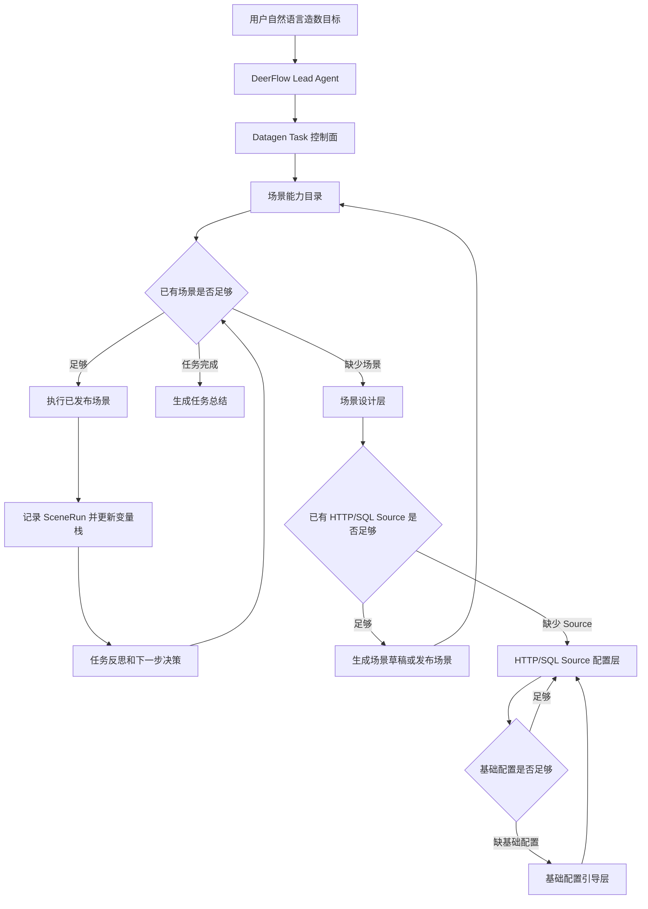

# GDP 造数任务智能编排 Task 架构设计

## 1. 背景

GDP datagen 当前已经具备基础配置、HTTP 接口配置、SQL 配置、造数场景配置和造数场景执行能力。现有场景执行器可以读取已发布场景版本，按步骤依赖拓扑执行 HTTP/SQL 节点，并把单次场景执行结果保存为场景运行记录。

现在要补齐的是更上一层的“用户级造数任务”能力：用户用一句自然语言描述目标后，Agent 能判断已有造数场景是否足够，逐步执行场景，校验结果，持续逼近目标；如果已有场景不足，再引导用户设计新场景；如果设计新场景缺少 HTTP/SQL 原子配置，再引导配置 HTTP/SQL；如果 HTTP/SQL 配置缺少系统、环境、服务端点或数据源，再引导补齐基础配置。

因此，本设计的核心不是“让 Agent 直接新增 HTTP/SQL 配置”，而是新增一个 **Datagen Task 控制面**，让 DeerFlow Agent 通过明确的阶段、工具和领域状态驱动造数任务。

## 2. 当前代码事实

### 2.1 已具备能力

当前代码中，造数场景已经是稳定的执行原子：

- `SceneDefinition` 描述场景身份、入参、步骤、结果映射和错误策略。
- `HttpStepDefinition` 描述场景内 HTTP 步骤快照。
- `SqlStepDefinition` 描述场景内 SQL 步骤快照。
- `SceneRunRequest` 描述场景运行请求。
- `SceneExecutionResult` 描述场景运行结果。
- `SceneExecutor` 已经能按拓扑顺序执行步骤，并在 `STOP_ON_ERROR` 策略下停止。
- `SceneService.run_scene` 已经固定读取已发布场景版本，并保存场景运行记录。

这说明 Task 层不应该重新实现 HTTP/SQL 执行，也不应该绕过场景直接运行 HTTP/SQL。Task 层应该把已发布场景当成可审计、可复用、可回放的执行原子。

### 2.2 缺失能力

`backend/app/gdp/datagen/config/task/` 下的 `models.py`、`service.py`、`repository.py`、`validation.py`、`api.py` 当前还没有落地。

缺失的不是某一个工具，而是完整的用户级任务控制面：

- 用户任务的领域模型。
- 用户任务的执行计划。
- 跨场景变量栈。
- 多场景执行历史。
- Agent 阶段状态。
- 资源缺口和业务失败的区分。
- 任务级反思和最终总结。
- 从缺场景到场景设计，再到 Source 配置，再到基础配置的递归回归机制。

### 2.3 现有基础配置关系

基础配置已经形成三层关系：

- HTTP Source 只保存 `sysCode` 和相对 `path`，运行时通过 `envCode + sysCode` 解析服务端点 `baseUrl`。
- SQL Source 保存 `sysCode + datasourceCode`，运行时通过 `envCode + sysCode + datasourceCode` 解析数据源。
- Scene 步骤保存 HTTP/SQL 快照，运行时不回读基础 Source 当前内容。

这决定了 Agent 不能凭用户一句话直接写 `sysCode`、`envCode`、`datasourceCode`。它必须通过资源目录完成候选匹配、置信度判断、缺口识别和用户确认。

## 3. 目标和非目标

### 3.1 目标

1. 支持用户用自然语言下达造数任务。
2. Agent 能优先判断已有已发布造数场景是否能满足任务。
3. Agent 能生成总体计划，并把计划拆解为单步任务。
4. Agent 能在 loop 中执行单步、校验结果、更新变量栈、反思下一步。
5. 任务执行中调用的场景和场景执行详情要记录到任务执行历史。
6. 场景执行出现业务错误时，终止整个造数任务。
7. 发现没有可用场景时，引导用户进入场景设计。
8. 场景设计优先复用已有 HTTP/SQL Source。
9. 缺少 HTTP/SQL Source 时，引导用户配置 Source。
10. Source 配置缺少系统、环境、服务端点或数据源时，引导用户补齐基础配置。
11. Agent 在深层配置完成后，能回到原始造数目标继续推进。

### 3.2 非目标

1. 第一阶段不要求 Agent 自动完成所有复杂场景设计。
2. 第一阶段不要求接入向量库或知识图谱。
3. Task 层不重新实现 HTTP/SQL 执行器。
4. Task 层不绕过已发布场景直接执行 HTTP/SQL。
5. Agent 不应该在任意阶段看到所有资源和所有工具。
6. Agent 不应该只靠关键词命中决定调用 HTTP 工具还是 SQL 工具。

## 4. 总体架构结论

推荐架构是 **DeerFlow 负责会话和工具编排，GDP Datagen 负责领域状态和执行事实**。

DeerFlow Lead Agent 不是业务状态机本身。业务状态必须落在 GDP datagen Task 层，这样任务才能审计、恢复、回放和排查。



整个系统分为五个平面：

| 平面 | 职责 | 不应该做的事 |
| --- | --- | --- |
| 会话控制平面 | DeerFlow 对话、流式事件、工具调用、子 Agent 委托 | 保存业务权威状态 |
| Task 领域平面 | 保存用户级造数任务、计划、步骤、变量、历史、失败原因 | 直接执行 HTTP/SQL |
| 能力目录平面 | 提供场景、HTTP Source、SQL Source、基础配置的分层检索 | 把全部资源一次性塞给 Agent |
| 执行平面 | 调用已发布 Scene，保存场景运行记录 | 在运行期回读基础 Source 模板 |
| 设计配置平面 | 缺资源时引导设计场景、配置 Source、补齐基础配置 | 越级修改不属于当前阶段的资源 |

## 5. 核心领域概念

### 5.1 DatagenTaskRun

`DatagenTaskRun` 是用户一次自然语言造数任务的权威记录。

建议字段：

| 字段 | 含义 |
| --- | --- |
| `taskRunId` | 任务运行 ID |
| `deerflowThreadId` | 绑定的 DeerFlow thread ID，也是 LangGraph checkpoint 恢复游标 |
| `deerflowRunId` | 最近一次 DeerFlow run ID |
| `lastCheckpointId` | 最近一次 checkpoint ID，用于恢复、排查和可选回放 |
| `userIntent` | 用户原始输入 |
| `normalizedGoal` | Agent 归一化后的目标 |
| `envCode` | 当前任务目标环境；用户未指定时默认 `DEV` |
| `status` | `PLANNING/RUNNING/WAITING_USER/COMPLETED/FAILED/CANCELLED` |
| `phase` | 当前 Agent 所处阶段 |
| `pendingInterruptsJson` | 等待用户输入时的 interrupt payload、interrupt id 和业务问题 |
| `goalStackJson` | 根目标和递归子目标栈 |
| `planJson` | 当前总体计划 |
| `visibleVariablesJson` | 当前变量栈 |
| `reflectionJson` | 阶段反思和下一步判断 |
| `failureType` | 失败类型 |
| `failureMessage` | 失败原因 |
| `finalSummary` | 最终总结 |
| `createdBy` | 创建人 |
| `createdAt` | 创建时间 |
| `updatedAt` | 更新时间 |
| `finishedAt` | 完成时间 |

### 5.2 DatagenTaskStep

`DatagenTaskStep` 是任务计划中的一个可执行或可引导步骤。

建议字段：

| 字段 | 含义 |
| --- | --- |
| `taskStepId` | 任务步骤 ID |
| `taskRunId` | 所属任务 |
| `stepNo` | 步骤序号 |
| `phase` | 步骤所在阶段 |
| `stepType` | `RUN_SCENE/DESIGN_SCENE/CONFIG_HTTP_SOURCE/CONFIG_SQL_SOURCE/CONFIG_INFRA/ASK_USER/REFLECT` |
| `goal` | 该步骤目标 |
| `status` | `PENDING/RUNNING/SUCCESS/FAILED/SKIPPED/WAITING_USER` |
| `selectedResourceJson` | 选中的场景、Source 或基础配置 |
| `inputBindingJson` | 入参绑定 |
| `outputJson` | 步骤产出 |
| `sceneRunId` | 如果调用了场景，记录对应场景运行 ID |
| `errorType` | 步骤错误类型 |
| `errorMessage` | 步骤错误说明 |
| `startedAt` | 开始时间 |
| `finishedAt` | 结束时间 |

### 5.3 DatagenTaskEvent

`DatagenTaskEvent` 是任务过程的审计事件。

建议记录：

- Agent 生成总体计划。
- 检索场景候选。
- 选择某个场景。
- 执行场景。
- 场景运行成功或失败。
- 更新变量栈。
- 进入场景设计。
- 进入 HTTP/SQL Source 配置。
- 进入基础配置引导。
- 等待用户确认。
- 用户补充信息。
- 任务完成或终止。

这张表对排查 Agent 为什么这么做非常关键。

### 5.4 GoalStack

`GoalStack` 解决递归下探后忘记根目标的问题。

示例：

```json
[
  {
    "goalType": "DATAGEN_TASK",
    "goal": "造一个已支付订单",
    "phase": "SCENE_FULFILLMENT"
  },
  {
    "goalType": "DESIGN_SCENE",
    "goal": "设计已支付订单场景",
    "phase": "SCENE_DESIGN"
  },
  {
    "goalType": "CONFIG_HTTP_SOURCE",
    "goal": "配置支付订单接口",
    "phase": "SOURCE_CONFIG"
  },
  {
    "goalType": "CONFIG_INFRA",
    "goal": "配置支付系统测试环境 Base URL",
    "phase": "INFRA_CONFIG"
  }
]
```

基础配置完成后，从栈顶弹出，回到 HTTP Source 配置；HTTP Source 配置完成后，再回到场景设计；场景设计完成后，再回到原始造数任务。

### 5.5 VisibleVariables

`VisibleVariables` 是 Agent 的跨步骤变量栈。

来源包括：

1. 用户任务输入。
2. 已执行场景的最终输出。
3. 已执行场景步骤的重要输出摘要。
4. 设计中场景的预期输出。
5. 系统变量，如 `uuid`、`now`、`timestamp`。

示例：

```json
[
  {
    "name": "orderId",
    "source": "${task.steps.createOrder.finalOutput.orderId}",
    "semanticType": "ORDER_ID",
    "label": "订单号",
    "valuePreview": "O202606090001",
    "confidence": 1.0
  }
]
```

变量栈不是只服务下一步，而是服务整个后续规划。第 4 步可以引用第 1 步的输出，只要依赖链和语义契约允许。

### 5.6 VisibleVariables 的双层数据策略

`VisibleVariables` 不能把所有运行结果原样注入 Agent Prompt。场景执行结果里可能包含大 JSON、列表结果、分页数据或接口完整响应，例如商品列表、账户明细、SQL 查询行集。如果直接把这些数据拼进后续 LLM 上下文，会快速造成 token 膨胀，并降低规划稳定性。

因此变量栈必须区分“落库全量值”和“注入摘要值”。

| 字段 | 用途 |
| --- | --- |
| `value` | 全量值，落库保存，供后续确定性工具按引用读取 |
| `valueSchema` | 值结构摘要，例如对象字段、数组元素结构、字段类型 |
| `valuePreview` | 给 Agent Prompt 使用的短预览，例如字符串截断、数组前 2 条、对象关键字段 |
| `valueSize` | 全量值大小，例如字符数、数组长度、行数 |
| `storageRef` | 大对象外置存储引用，避免 TaskRun 行过大 |
| `sensitive` | 是否敏感，敏感值不进入 Prompt |

推荐变量结构：

```json
{
  "name": "skuList",
  "source": "${task.steps.querySku.finalOutput.rows}",
  "semanticType": "SKU_LIST",
  "label": "可售商品列表",
  "value": [
    {"skuId": "SKU001", "name": "测试商品1", "price": 100},
    {"skuId": "SKU002", "name": "测试商品2", "price": 200}
  ],
  "valueSchema": {
    "type": "array",
    "itemFields": {
      "skuId": "string",
      "name": "string",
      "price": "number"
    }
  },
  "valuePreview": [
    {"skuId": "SKU001", "name": "测试商品1"},
    {"skuId": "SKU002", "name": "测试商品2"}
  ],
  "valueSize": {
    "itemCount": 2000
  }
}
```

Agent 后续规划只能默认看到 `name`、`semanticType`、`label`、`remark`、`valueSchema`、`valuePreview` 和 `valueSize`。如果确实需要读取全量值，必须通过确定性工具按 `storageRef` 或变量引用读取，并做权限和大小控制。

这意味着 DatagenTaskStep 写入变量栈时需要同步生成摘要。摘要逻辑不应该交给 Prompt 临时决定，而应该作为 Task Service 的确定性能力：

```text
SceneExecutionResult.finalOutput
  -> extract visible variables
  -> persist full value
  -> build schema / preview / size
  -> inject only compact variables to Agent
```

## 6. Agent 阶段模型

Agent 必须有显式阶段。阶段决定它能看哪些资源、能调用哪些工具、遇到缺口时如何下探。

### 6.1 阶段列表

| 阶段 | 目标 | 可见资源 | 允许工具 |
| --- | --- | --- | --- |
| `INTAKE` | 理解用户目标，形成标准任务目标 | 少量环境、历史任务摘要 | 创建 TaskRun、提取目标 |
| `SCENE_FULFILLMENT` | 只用已有场景完成任务 | 已发布场景能力契约 | 搜索场景、读取场景契约、执行场景 |
| `SCENE_EXECUTING` | 执行一个已选场景 | 选中的场景契约和入参绑定 | 调用 `SceneService.run_scene` |
| `PROGRESS_REFLECTION` | 校验结果是否逼近目标 | 当前计划、变量栈、执行结果 | 更新变量栈、更新计划、完成或继续 |
| `SCENE_DESIGN` | 设计缺失场景 | HTTP/SQL Source 能力契约 | 搜索 Source、生成场景草稿、校验 DAG |
| `SOURCE_CONFIG` | 配置缺失 HTTP/SQL Source | 对应 Source 配置表和必要基础摘要 | 新增或测试 HTTP/SQL Source |
| `INFRA_CONFIG` | 补齐系统、环境、端点、数据源 | 基础配置 | 新增系统、环境、服务端点、数据源 |
| `WAITING_USER` | 等待用户确认或补充信息 | 当前问题上下文 | 记录用户反馈 |
| `COMPLETED` | 任务完成 | 完整任务历史 | 生成总结 |
| `FAILED` | 任务失败 | 错误上下文 | 生成失败总结 |

### 6.2 阶段隔离原则

Agent 在每个阶段只能看到该阶段相关资源。

这点非常关键：

- 用户说“造一个已支付订单”时，Agent 先搜场景，不应该立刻查系统、环境、数据源。
- 场景不存在时，才进入场景设计。
- 场景设计缺少支付接口时，才进入 HTTP Source 配置。
- HTTP Source 配置发现支付系统测试环境缺 Base URL 时，才进入基础配置。

这就是 TODO 中提到的“资源层级专注模型”。它避免 Agent 在一开始就陷入海量配置资源，降低误判和上下文噪声。

## 7. Task 执行 Loop

Task 的主循环可以抽象为：

```text
读取 TaskRun 当前状态
  -> 根据 phase 加载对应能力目录
  -> 生成或更新下一步计划
  -> 执行当前单步
  -> 记录 TaskStep 和 TaskEvent
  -> 如果是场景执行，保存 sceneRunId
  -> 校验执行结果
  -> 更新 VisibleVariables
  -> 反思总体目标是否完成
  -> 完成、失败、等待用户或进入下一轮
```

### 7.1 伪流程

```text
用户：帮我造一笔已支付订单

1. 创建 DatagenTaskRun
2. phase = SCENE_FULFILLMENT
3. 搜索已发布场景能力契约
4. 判断是否存在：
   - 创建订单场景
   - 支付订单场景
   - 或已支付订单复合场景
5. 如果找到复合场景：
   - 绑定入参
   - 调用 SceneService.run_scene
   - 保存 sceneRunId 到 DatagenTaskStep
   - 将 finalOutput 写入 VisibleVariables
   - 判断任务是否完成
6. 如果只找到创建订单场景：
   - 执行创建订单
   - 变量栈获得 orderId
   - 继续搜索可消费 ORDER_ID 的支付场景
7. 如果支付场景不存在：
   - phase = SCENE_DESIGN
   - 引导用户是否开始设计支付订单场景
```

### 7.2 总体目标反思

每次步骤执行后都要做任务级反思，而不是只看单步是否成功。

反思问题：

1. 当前任务目标是否已经满足？
2. 当前变量栈是否包含最终需要交付给用户的核心字段？
3. 当前执行是否引入了新的前置条件？
4. 是否需要继续搜索下游场景？
5. 是否出现业务错误，需要终止整个任务？
6. 是否只是资源缺失，需要下探到设计或配置阶段？

反思结果必须写入 `reflectionJson` 或 `DatagenTaskEvent`，不能只存在于 LLM 上下文。

## 8. 资源目录和检索设计

### 8.1 不采用“关键词命中即可”

关键词命中只能做初筛，不能作为最终判断。

原因：

- 用户说“订单”，系统里可能叫“交易”“下单”“销售单”。
- 用户说“支付”，接口可能叫 `/settle/confirm`。
- `userId`、`buyerId`、`customerNo` 字段名不同但语义可能一致。
- 相同关键词可能存在多个系统，必须结合环境、系统归属、输入输出语义判断。

因此，资源检索应该采用“多因子评分”。

### 8.2 场景能力目录

场景能力目录只暴露已发布场景的能力契约，不暴露完整步骤内部配置。

建议契约：

```json
{
  "sceneCode": "create_paid_order",
  "sceneName": "创建已支付订单",
  "sceneRemark": "创建一笔订单并完成支付，返回 orderId、payOrderId 和 orderStatus。",
  "status": "PUBLISHED",
  "tags": ["ORDER", "PAYMENT"],
  "capabilityType": "CREATE",
  "inputSchema": [],
  "resultSchema": [],
  "preconditions": [],
  "sideEffects": []
}
```

搜索评分维度：

| 维度 | 说明 |
| --- | --- |
| 名称匹配 | `sceneName` 命中用户意图 |
| 备注匹配 | `sceneRemark` 命中业务描述 |
| 标签匹配 | 业务域标签命中 |
| 产出匹配 | `resultSchema.semanticType` 能满足目标 |
| 入参可绑定 | `inputSchema` 能从用户输入或变量栈绑定 |
| 前置条件可满足 | `preconditions` 已满足或可通过其他场景满足 |
| 副作用符合 | 写入或变更行为符合用户目标 |
| 状态可用 | 必须是已发布且未禁用 |

### 8.3 Source 能力目录

Source 能力目录只在 `SCENE_DESIGN` 阶段使用。

HTTP Source 契约建议包含：

- `sourceCode`
- `sourceName`
- `sysCode`
- `method`
- `path`
- `bodySchema`
- `responseSchema`
- `outputMapping`
- `outputMeta`
- `semantic`

SQL Source 契约建议包含：

- `sourceCode`
- `sourceName`
- `sysCode`
- `datasourceCode`
- `operation`
- `tables`
- `resultFields`
- `conditionFields`
- `parameters`
- `semantic`

搜索 Source 时要结合当前场景设计的变量栈：

- 优先找能消费当前变量的 Source。
- 优先找能产出缺失变量的 Source。
- 优先找同一业务域、同一系统或可解释跨系统调用的 Source。

### 8.4 基础配置目录

基础配置目录只在 `SOURCE_CONFIG` 和 `INFRA_CONFIG` 阶段使用。

基础配置匹配不能只返回“命中了什么”，而要返回“候选、置信度和缺口”。

示例：

```json
{
  "matchedSystems": [
    {
      "sysCode": "trade",
      "sysName": "交易系统",
      "aliases": ["交易", "订单系统"],
      "serviceEndpoints": [
        {
          "envCode": "test",
          "baseUrl": "http://trade-test.example"
        }
      ],
      "datasources": [
        {
          "envCode": "test",
          "datasourceCode": "tradeDb"
        }
      ]
    }
  ],
  "matchedEnvironments": [],
  "matchedDatasources": [],
  "confidence": 0.92,
  "missingFields": []
}
```

Agent 对这个结果的理解规则：

| 情况 | 处理方式 |
| --- | --- |
| 高置信度且无缺口 | 自动采用，并记录选择理由 |
| 中置信度或多候选 | 让用户确认 |
| 低置信度 | 不自动采用，转为提问 |
| 无命中 | 引导新增基础配置 |
| 命中系统但缺目标环境端点 | 引导配置服务端点 |
| 命中系统但缺数据源 | 引导配置数据源 |

### 8.5 第一阶段检索增强：别名词典优先于向量库

当前代码里的检索能力仍然偏精确过滤：

- 场景列表主要按 `scene_code`、`scene_name` 做 LIKE。
- HTTP Source / SQL Source 列表主要按 `sysCode`、`status` 过滤。
- 基础配置主要是系统、环境、服务端点、数据源列表和精确查询。

因此第一阶段如果不引入向量库，不能指望“用户原句关键词”直接命中资源。需要新增一个确定性的检索增强层：

```text
用户原始意图
  -> LLM 或规则抽取业务关键词、动作、实体、目标字段
  -> 术语归一化
  -> 别名词典扩展
  -> 数据库多字段联合检索
  -> 多因子加权评分
  -> 返回候选、置信度、缺口和命中解释
```

别名词典应该是领域资产，而不是只写在 Prompt 里。例如：

```json
{
  "订单": ["交易单", "下单", "销售单", "order", "trade"],
  "支付": ["付款", "收银", "结算", "pay", "settle"],
  "用户": ["会员", "客户", "买家", "user", "customer", "buyer"]
}
```

检索 API 不应该只返回“命中列表”，还要返回命中原因，方便 Agent 判断是否需要确认：

```json
{
  "candidates": [
    {
      "resourceType": "SCENE",
      "resourceCode": "create_paid_order",
      "score": 0.91,
      "matchedBy": ["sceneName", "resultSchema.semanticType", "alias:订单->交易单"],
      "missingInputs": []
    }
  ],
  "confidence": 0.91,
  "needUserConfirm": false
}
```

第一阶段建议先做数据库 LIKE + 别名扩展 + 加权评分，不急着接向量库。等场景、Source 的语义字段逐步沉淀后，再升级成混合检索：

```text
结构化过滤
  + 关键词/别名召回
  + 语义向量召回
  + LLM rerank
```

这样既能降低早期复杂度，又能避免 Agent 因为“订单”和“交易单”这种表达差异过早判断无命中。

## 9. 场景复用和场景设计分支

### 9.1 已有场景优先

如果已有造数场景能够完成任务，就不应该新增场景。

这是系统的基本策略：

```text
先用已有场景完成用户任务
  -> 不够时才设计新场景
  -> 设计新场景时先复用已有 Source
  -> Source 不够时才新增 Source
  -> 基础配置不够时才新增基础配置
```

这样做有三个好处：

1. 避免重复场景膨胀。
2. 复用已验证能力，降低执行风险。
3. 保持任务历史清晰，知道用户任务实际用了哪些稳定场景。

### 9.2 什么时候转入场景设计

只有以下情况才转入 `SCENE_DESIGN`：

1. 没有任何场景能满足当前子目标。
2. 有候选场景，但必填入参无法由用户输入或变量栈提供。
3. 候选场景产出无法满足下游目标。
4. 场景语义质量太低，无法安全判断。
5. 用户明确要求新增或改造场景。

转入前应该向用户说明：

- 当前任务缺少什么能力。
- 已有场景为什么不够。
- 设计新场景大概需要哪些原子能力。
- 是否现在开始设计。

### 9.3 场景设计输出

场景设计 Agent 不直接执行 HTTP/SQL，而是生成 `SceneDefinition` 草稿。

输出至少包括：

- 场景名称和说明。
- 入参结构。
- 步骤列表。
- HTTP/SQL Source 导入或自定义快照。
- 步骤依赖。
- 参数映射。
- 输出映射。
- 结果结构。
- 发布校验结果。

允许 Agent 自动发布新生成的场景，但必须满足三个条件：

1. 场景定义通过发布校验。
2. 发布动作和发布结果写入 `DatagenTaskEvent`。
3. 如果新场景包含写操作，首次执行前必须进入 `WAITING_USER` 让用户确认。

这里要区分“发布场景”和“执行写操作场景”。发布表示把能力沉淀为可复用场景；执行写操作会真实改变目标环境数据，因此默认需要用户确认后才能执行。

## 10. HTTP/SQL Source 配置设计

### 10.1 Source 配置触发条件

只有在 `SCENE_DESIGN` 阶段确认缺少原子能力时，才进入 `SOURCE_CONFIG`。

例如：

- 场景设计需要“支付订单接口”，但 HTTP Source 目录找不到。
- 场景设计需要“查询订单状态 SQL”，但 SQL Source 目录找不到。
- 找到 Source，但语义或字段不完整，无法完成映射。

### 10.2 HTTP Source Agent 工具职责

HTTP Source 工具不应该做场景编排，也不应该配置数据库。

建议工具：

| 工具 | 职责 |
| --- | --- |
| `inspect_http_source_requirements` | 根据用户描述、curl、接口文档或 JSON 样例抽取 HTTP 配置需求 |
| `resolve_http_source_basis` | 解析并确认 `sysCode`、目标环境服务端点是否存在 |
| `upsert_http_source` | 保存 HTTP Source |
| `test_http_source` | 调用现有测试能力验证接口 |
| `infer_http_output_mapping` | 根据响应样例生成输出映射和元数据 |

如果缺少 `sysCode` 或服务端点，HTTP Source 工具应该返回资源缺口，不应该自己越级猜测或创建基础配置。

### 10.3 SQL Source Agent 工具职责

SQL Source 工具不应该做场景编排，也不应该配置 HTTP 服务端点。

建议工具：

| 工具 | 职责 |
| --- | --- |
| `inspect_sql_source_requirements` | 根据用户描述或 SQL 文本抽取 SQL 配置需求 |
| `parse_sql_source` | 复用已有 SQL 解析能力 |
| `resolve_sql_source_basis` | 解析并确认 `sysCode + datasourceCode` |
| `upsert_sql_source` | 保存 SQL Source |
| `test_sql_source` | 复用 SQL 测试执行能力 |
| `infer_sql_output_mapping` | 根据结果字段生成输出映射建议 |

如果缺少数据源，SQL Source 工具返回 `MISSING_DATASOURCE`，由 Task 控制面切到 `INFRA_CONFIG`。

## 11. 基础配置引导设计

### 11.1 基础配置不是入口

基础配置不应该在用户任务开始时立刻触发。

基础配置只服务于明确的上层缺口：

- 配 HTTP Source 时缺系统。
- 配 HTTP Source 时缺目标环境服务端点。
- 配 SQL Source 时缺系统。
- 配 SQL Source 时缺目标环境数据源。
- 用户明确要求维护基础配置。

### 11.2 基础配置工具

建议工具：

| 工具 | 职责 |
| --- | --- |
| `search_system_basis` | 按业务域、系统名、别名查系统候选 |
| `search_environment_basis` | 查环境候选 |
| `search_service_endpoint_basis` | 查 `envCode + sysCode` 服务端点 |
| `search_datasource_basis` | 查 `envCode + sysCode` 数据源 |
| `upsert_system` | 新增或更新系统 |
| `upsert_environment` | 新增或更新环境 |
| `upsert_service_endpoint` | 新增服务端点 |
| `upsert_datasource` | 新增数据源 |

### 11.3 用户确认策略

基础配置通常影响面较大，需要更谨慎：

| 资源 | 自动采用条件 | 需要用户确认条件 |
| --- | --- | --- |
| 系统 | 唯一高置信度候选，名称和别名明确命中 | 多个候选、低置信度、系统状态禁用 |
| 环境 | 用户明确指定且环境存在启用；用户未指定时默认采用 `DEV` | `DEV` 不存在、被禁用，或用户描述中出现生产、预发、测试等与 `DEV` 冲突的线索 |
| 服务端点 | 精确 `envCode + sysCode` 命中且启用 | 缺失、禁用、Base URL 看起来不匹配 |
| 数据源 | 精确 `envCode + sysCode + datasourceCode` 命中且启用 | 多数据源候选或用户未说明库 |

`DEV` 是默认环境标识，不代表跳过环境确认。Agent 在创建 TaskRun 时如果用户没有明确指定环境，可以把 `envCode` 置为 `DEV`，并在 TaskEvent 中记录默认来源。如果 `DEV` 对应的服务端点或数据源缺失，再进入 `INFRA_CONFIG` 引导补齐。

## 12. 业务错误和资源缺口

Task 层必须严格区分业务错误、资源缺口、技术错误和歧义。

| 类型 | 示例 | 处理方式 |
| --- | --- | --- |
| 业务错误 | 创建订单返回商品不存在、支付失败、SQL 业务断言失败 | 终止整个任务 |
| 资源缺口 | 缺场景、缺 Source、缺系统、缺数据源 | 下探到设计或配置阶段 |
| 歧义 | 多个交易系统候选、多套测试环境 | 进入 `WAITING_USER` |
| 技术错误 | 网络超时、数据库连接异常、服务不可用 | Task 层默认不重试，重试由 Scene 内部错误策略控制 |
| 配置错误 | 场景发布配置不完整、表达式无法解析 | 停止当前分支，提示修复配置 |

### 12.1 为什么业务错误要终止整个任务

造数任务通常是有业务前后文的。比如“造已支付订单”中，如果创建订单失败，后续支付、查询、校验都没有意义。继续执行可能产生脏数据或误导结果。

因此规则应该是：

```text
场景执行结果为业务失败
  -> Task status = FAILED
  -> 记录失败场景、失败步骤、失败消息
  -> 停止后续计划
  -> 输出失败总结
```

### 12.2 资源缺口不是失败

资源缺口表示当前能力池不足，系统可以引导用户补齐。

例如：

```text
缺少支付订单场景
  -> 进入 SCENE_DESIGN

缺少支付订单 HTTP Source
  -> 进入 SOURCE_CONFIG

缺少支付系统测试环境 Base URL
  -> 进入 INFRA_CONFIG
```

只要用户愿意补充，就不应该把 Task 标记为失败，而应该标记为 `WAITING_USER` 或对应配置阶段。

## 13. DeerFlow 集成方式

### 13.1 不修改通用 Lead Agent 为业务 Agent

DeerFlow 的 Lead Agent 是通用 Agent。建议通过工具组、技能或自定义 Agent 配置接入 datagen 能力，而不是把 datagen 业务逻辑写死到通用 prompt。

推荐方式：

1. 新增 datagen 专用工具组。
2. 新增 datagen 专用 Agent 或技能。
3. 工具内部调用 GDP datagen Task 服务。
4. DeerFlow 只负责对话推进、工具调用和流式展示。

### 13.2 子 Agent 定位

DeerFlow 的 subagent 适合承载专家分工，但不适合充当业务状态机。

建议专家分工：

| Agent | 职责 |
| --- | --- |
| Datagen Coordinator | 理解用户目标，驱动 Task 状态机 |
| Scene Fulfillment Expert | 搜索和选择已有场景 |
| Scene Design Expert | 用 HTTP/SQL Source 设计场景 |
| HTTP Source Expert | 配置 HTTP Source |
| SQL Source Expert | 配置 SQL Source |
| Infra Expert | 配置系统、环境、服务端点、数据源 |

每个专家 Agent 都应该受阶段约束。比如 HTTP Source Expert 发现缺 Base URL 时，只返回 `MISSING_SERVICE_ENDPOINT`，由 Coordinator 切换到 Infra Expert。

### 13.3 ThreadState 和 TaskRun 的关系

`ThreadState` 可以保存轻量引用：

```json
{
  "datagen": {
    "taskRunId": "task_001",
    "phase": "SCENE_FULFILLMENT",
    "lastEventId": "evt_010"
  }
}
```

但完整状态必须落库到 GDP Task 表中。

原因：

1. DeerFlow 线程可能被摘要压缩。
2. Agent 上下文可能丢失细节。
3. 用户级造数任务需要审计。
4. 后端需要能独立查询任务历史。
5. 后续可以支持恢复执行和人工接管。

### 13.4 复用 DeerFlow Runtime，替换 GDP Graph Logic

本轮澄清后的推荐路线是：**借用 DeerFlow 的 Runtime 基础设施，运行 GDP 自己定义的 LangGraph 业务图**。

这不是继续把 GDP 造数逻辑塞进通用 Lead Agent，也不是完全脱离 DeerFlow 重写运行框架，而是把两层职责拆开：

| 层次 | DeerFlow 负责 | GDP 负责 |
| --- | --- | --- |
| Runtime 层 | RunManager、StreamBridge、Checkpointer、RunEventStore、线程状态、SSE、取消、rollback | 不重复建设 |
| Graph Logic 层 | 提供可运行的 LangGraph 容器 | 定义 GDPState、阶段路由、任务 loop、资源下探、业务工具 |
| 业务事实层 | 不作为业务权威数据库 | `DatagenTaskRun`、`DatagenTaskStep`、`DatagenTaskEvent` 落库 |

核心判断：

```text
DeerFlow Runtime 管一次 Agent Run 怎么运行。
GDP Task 控制面管一次造数任务事实上发生了什么。
GDP 自定义 Graph 管造数任务下一步应该怎么推进。
```

### 13.5 为什么不直接复用通用 Lead Agent

通用 Lead Agent 的目标是开放式助手，适合处理各种对话、文件、工具和子任务。GDP 造数任务是强领域流程，具备明确的阶段、错误语义、资源层级和审计要求。

如果继续让通用 Lead Agent 直接承担 GDP 主流程，会出现几个问题：

1. 造数任务状态容易散落在对话上下文中。
2. Agent 可以看到过多无关工具，增加误调用风险。
3. 场景执行、场景设计、Source 配置、基础配置之间的阶段边界不够硬。
4. 中断恢复只能恢复对话图状态，无法表达 GDP 业务上的等待原因。
5. 后续要做任务历史、任务恢复、人工接管时缺少稳定领域模型。

因此，GDP 应该拥有自己的 LangGraph 主图。通用 Lead Agent 可以继续存在，但 GDP 造数入口应路由到 `gdp_agent`。

### 13.6 准确接入点：Agent Factory，而不是直接传 Graph

DeerFlow 当前 Runtime 的执行入口不是简单的：

```python
run_agent(graph=graph, input=inputs, thread_id=thread_id)
```

实际的 `run_agent` 位于 `backend/packages/harness/deerflow/runtime/runs/worker.py`，它接收的是 `agent_factory`、`graph_input`、`config`、`RunContext`、`StreamBridge` 和 `RunManager`。Worker 会负责：

1. 创建并更新 Run 状态。
2. 发布 metadata SSE。
3. 注入 `thread_id`、`run_id`、`app_config` 等 runtime context。
4. 调用 `agent_factory(config=...)` 创建实际图对象。
5. 注入 checkpointer 和 store。
6. 执行 `agent.astream(...)`。
7. 把 LangGraph stream chunk 转成 SSE 事件。
8. 写 RunJournal 和 token 用量。
9. 发布 `end` 事件。

所以 GDP 的接入方式应该是新增一个 Graph Factory：

```python
def make_gdp_agent(config, app_config=None):
    graph = build_gdp_graph()
    return graph
```

这里建议显式保留 `app_config` 参数。当前 DeerFlow worker 会检查 factory 签名，如果发现参数里有 `app_config`，就调用：

```python
agent_factory(config=runnable_config, app_config=ctx.app_config)
```

否则只调用：

```python
agent_factory(config=runnable_config)
```

GDP Task 后续访问模型配置、运行时配置、连接池或其他应用级依赖时，很可能需要 `app_config`。即使第一版 Task Repository 仍然通过现有 `get_session_factory()` 取得数据库会话，也应该把 factory 签名设计成：

```python
def make_gdp_agent(config: RunnableConfig, app_config: AppConfig | None = None):
    ...
```

这样可以和 DeerFlow Runtime 当前注入方式对齐，避免后续需要改 gateway/worker 接口。

然后在 gateway 的 agent factory 解析逻辑中，把 `assistant_id = "gdp_agent"` 路由到 `make_gdp_agent`。

推荐最小改动：

```python
def resolve_agent_factory(assistant_id: str | None):
    if assistant_id == "gdp_agent":
        from app.gdp.agent.graph import make_gdp_agent
        return make_gdp_agent

    from deerflow.agents.lead_agent.agent import make_lead_agent
    return make_lead_agent
```

当前代码里的 `resolve_agent_factory()` 仍然把所有 `assistant_id` 都路由到 `make_lead_agent`，只是通过 `agent_name` 做通用 Agent 配置切换。因此真正落地 GDP 自定义 Graph 时，必须同步修改 gateway 的 factory 路由，并更新对应测试断言，不能只在前端传 `assistant_id = "gdp_agent"`。

这样前端仍然可以复用 DeerFlow 现有 run/stream API，只需要在请求里指定：

```json
{
  "assistant_id": "gdp_agent",
  "input": {
    "messages": [
      {
        "role": "user",
        "content": "帮我造一个已支付订单"
      }
    ]
  }
}
```

### 13.7 GDP 自定义 Graph 的定位

GDP 自定义 Graph 不需要使用 `create_agent`。它可以是纯 LangGraph 状态机。

推荐主图结构：

```text
intake_goal
  -> create_or_load_task
  -> route_phase
  -> scene_fulfillment
  -> run_scene
  -> reflect_progress
  -> scene_design
  -> source_config
  -> infra_config
  -> ask_user
  -> finish_task / fail_task
```

推荐目录：

```text
backend/app/gdp/agent/
  graph.py
  state.py
  phases.py
  nodes/
    intake.py
    task_state.py
    scene_fulfillment.py
    scene_execution.py
    reflection.py
    scene_design.py
    source_config.py
    infra_config.py
    human_confirm.py
  tools/
    task_tools.py
    scene_tools.py
    source_tools.py
    infra_tools.py
  prompts/
    intake.md
    planner.md
    reflection.md
    scene_design.md
```

`make_gdp_agent` 返回 compiled graph 即可，不建议在 GDP graph factory 中自行创建 checkpointer。DeerFlow worker 会在运行时把 checkpointer 和 store 注入到返回的 graph 对象上，保持 Runtime 基础设施统一。

### 13.8 Checkpoint 和 TaskRun 的边界

DeerFlow Checkpointer 可以保存 LangGraph 运行快照，适合支持：

- 中断恢复。
- rollback。
- 从上一次 checkpoint 继续运行。
- 调试 GraphState。

但 Checkpoint 不能替代 GDP TaskRun。

二者边界如下：

| 数据 | 归属 | 用途 |
| --- | --- | --- |
| `GDPState` checkpoint | DeerFlow / LangGraph Checkpointer | 恢复图运行位置 |
| `df_datagen_task_run` | GDP Task 表 | 用户级造数任务主状态 |
| `df_datagen_task_step` | GDP Task 表 | 用户任务步骤和 sceneRunId 关联 |
| `df_datagen_task_event` | GDP Task 表 | 业务决策、资源缺口、用户确认、错误审计 |

必须坚持：

```text
Checkpoint 管“图跑到哪里了”。
TaskRun 管“造数任务事实上发生了什么”。
```

所有 Agent 推理都可以被 checkpoint 恢复或丢弃，但所有业务事实必须落到 GDP Task 表。

### 13.8.1 Time Travel 不是业务回滚

LangGraph 的 time travel 支持从历史 checkpoint replay 或 fork。文档里的关键规则是：从某个 checkpoint 继续时，该 checkpoint 之前的节点不会重跑，之后的节点会重新执行，包括 LLM 调用、API 请求和 `interrupt()`。

这对 GDP 很重要：

```text
LangGraph replay/fork 只能用于技术层调试、恢复或探索分支。
GDP 业务事实不能因为 time travel 被“回滚”。
```

如果未来要支持从历史 checkpoint 重新尝试，Task 层应该采用追加式审计：

| 场景 | 处理方式 |
| --- | --- |
| 从中断点继续 | 沿用同一 `taskRunId`，记录 `USER_REPLY` 和恢复后的新步骤 |
| 从历史 checkpoint 重试 | 新增 retry/fork 事件，后续步骤产生新的 `DatagenTaskStep` |
| 已执行过写操作场景 | 不允许无保护重放；必须通过 `sceneRunId`、步骤幂等键或人工确认防止重复写数据 |
| 探索替代路径 | 建议创建新的 task attempt 或 branch 标识，不能覆盖原历史 |

因此，`lastCheckpointId` 可以帮助定位恢复点，但业务历史以 `DatagenTaskEvent` 和 `DatagenTaskStep` 为准。不要把 `update_state()` 理解为“撤销业务数据”，它只是创建新的 checkpoint 分支。

### 13.9 Human-in-the-loop 的双状态设计

GDP 图中需要用户确认时，可以使用 LangGraph 的 `interrupt()` 暂停图运行，例如：

```text
发现多个系统候选
发现低置信度字段映射
执行高风险写操作前需要确认
缺少服务端点 Base URL
缺少数据源连接信息
```

但在调用 `interrupt()` 前，必须先更新 GDP TaskRun：

```text
TaskRun.status = WAITING_USER
TaskRun.phase = 当前阶段
TaskRun.pendingQuestion = 当前问题
TaskEvent = ASK_USER
```

原因是 DeerFlow RunStatus 只能表达运行时状态，例如 `interrupted`。它不知道 GDP 业务上到底是在等用户确认系统、填写 Base URL，还是确认是否发布场景。

正确边界：

```text
LangGraph interrupt 负责技术暂停和恢复。
GDP WAITING_USER 负责业务等待原因和页面展示。
```

用户回复后，恢复流程应同时做两件事：

1. 把用户回复写入 `DatagenTaskEvent`，更新 TaskRun 的 `pendingQuestion`。
2. 通过 DeerFlow 现有 run/stream 入口恢复同一 thread 的图执行。

### 13.9.1 `interrupt()` 恢复闭环

结合当前 LangGraph 版本，`interrupt()` 的恢复不能只靠“新增一条用户消息”。恢复时必须向同一个 `thread_id` 的 checkpoint 提交 `Command(resume=用户回复)`。LangGraph 会从中断节点的开头重新执行该节点，然后把 `resume` 值返回给对应的 `interrupt()` 调用。

因此 GDP 的 `POST /api/v1/datagen/tasks/runs/{taskRunId}/user-reply` 不能只做业务表更新。它应该形成完整闭环：

```text
收到用户回复
  -> 校验 TaskRun.status = WAITING_USER
  -> 写 DatagenTaskEvent(USER_REPLY)
  -> 清理或更新 pendingQuestion
  -> 定位 TaskRun 绑定的 deerflowThreadId / assistant_id
  -> 通过 DeerFlow run/stream 入口提交 Command(resume=userReply)
  -> 继续消费 SSE 或让前端接入恢复后的 run
```

当前 gateway 的 `RunCreateRequest` 已经有 `command` 字段，但 `start_run()` 目前只执行：

```python
graph_input = normalize_input(body.input)
```

也就是说，`command` 字段现在没有真正转换成 LangGraph `Command` 并传给 `agent.astream(...)`。落地时有两种可选方案：

| 方案 | 做法 | 适用情况 |
| --- | --- | --- |
| 在 DeerFlow gateway 补齐 `command` 支持 | `start_run()` 优先识别 `body.command`，构造 `langgraph.types.Command(resume=...)` 作为 `graph_input` | 希望复用标准 run/stream API |
| 在 GDP Task Service 内部调用 Runtime | `user-reply` 服务直接构造 `Command(resume=userReply)` 并启动同一 thread 的 run | 希望 GDP API 封装恢复细节 |

推荐第一阶段优先补齐 gateway 的 `command` 支持，因为它更符合 LangGraph Platform 风格，也能让后续其他 Agent 共享中断恢复能力。GDP 的 `user-reply` API 可以作为业务封装层，负责写事件、校验状态、再调用同一套 run/stream 恢复入口。

还需要注意一个编码细节：LangGraph 恢复时会从中断节点开头重新执行，所以 `interrupt()` 之前的写库操作必须幂等，或者在节点开头根据 `taskRunId + pendingQuestionId + eventType` 判断是否已经写过。否则用户回复一次，恢复节点可能重复写 `ASK_USER` 事件、重复生成待确认问题，甚至重复创建配置草稿。

### 13.9.2 `interrupt()` 节点编写约束

LangGraph 文档对动态中断有几条硬约束，GDP 图节点要按这些规则写：

1. `interrupt()` 的 payload 必须是 JSON 可序列化数据，不要传函数、类实例、数据库连接或复杂对象。
2. 不要用裸 `try/except Exception` 包住 `interrupt()`，否则可能吞掉 LangGraph 用来暂停图的特殊异常。
3. 同一个节点里如果有多个 `interrupt()`，顺序必须稳定。不要按非确定性条件跳过或重排中断。
4. 中断前的副作用必须幂等，或者把副作用放到中断之后，或者拆成独立节点。
5. 可以在工具内部调用 `interrupt()`，但 GDP 的写操作确认更建议收敛在 `human_confirm` 或 `approval` 节点，方便统一写 `TaskEvent`、展示业务问题和恢复状态。

推荐 GDP 中断 payload 结构：

```json
{
  "taskRunId": "task_001",
  "phase": "SCENE_EXECUTING",
  "questionType": "WRITE_SCENE_APPROVAL",
  "question": "是否执行会写入数据的创建订单场景？",
  "interruptId": "由 LangGraph 返回后回填",
  "details": {
    "sceneCode": "create_order",
    "envCode": "DEV",
    "sideEffects": ["CREATE_ORDER"]
  }
}
```

如果未来出现并行分支同时中断，恢复时不能只传一个普通值。LangGraph 支持按 interrupt id 传 resume map：

```python
Command(resume={
    "interrupt_id_1": user_answer_1,
    "interrupt_id_2": user_answer_2,
})
```

第一阶段建议避免并行 HITL：GDP 主图一次只挂起一个业务问题，降低前端和 TaskRun 状态管理复杂度。即使底层支持多 interrupt，也应该把多个问题聚合成一个结构化确认表单。

### 13.9.3 以本地 LangGraph 1.1.9 为准的流式约束

当前仓库后端实际安装版本是：

```text
langgraph==1.1.9
langchain==1.2.15
langchain-core==1.3.3
langgraph-checkpoint==4.0.2
langgraph-sdk==0.3.13
```

线上 `docs.langchain.com/oss/python/langgraph/interrupts` 是 current/latest 文档，不是本仓库 `langgraph==1.1.9` 的固定版本文档。实测本地 1.1.9 的 `CompiledStateGraph` 没有同步 `stream_events` 方法，只有：

```text
astream_events(..., version="v1" | "v2")
astream(..., version="v1" | "v2")
invoke(..., version="v1" | "v2")
```

因此不能把 latest 文档里的 `graph.stream_events(..., version="v3")`、`stream.interrupted`、`stream.interrupts` 直接作为本项目实现依据。

当前 DeerFlow worker 明确使用的是：

```python
agent.astream(graph_input, config=runnable_config, stream_mode=...)
```

并且当前 worker 代码说明 `events` mode 不走 gateway，因为 `astream_events()` 不能同时产出 DeerFlow 现在依赖的 `values` 快照。

本地 1.1.9 最小验证结果是：在 `astream(..., stream_mode="values")` 下，首次中断会在 values chunk 中出现：

```python
{
    "x": "hi",
    "__interrupt__": (
        Interrupt(value={"question": "name?"}, id="..."),
    ),
}
```

恢复时继续向同一 `thread_id` 提交：

```python
Command(resume="alice")
```

因此 GDP 第一阶段不能假设前端天然能拿到 latest 文档里的 `stream.interrupts` 投影。更稳妥的做法是：

1. GDP 节点在调用 `interrupt()` 前，先写 `TaskRun.status = WAITING_USER` 和 `DatagenTaskEvent(ASK_USER)`。
2. 同时通过 `custom` stream 发出 `gdp_waiting_user` 业务事件。
3. 继续保留 LangGraph checkpoint 里的 `__interrupt__` 作为技术恢复依据。
4. `user-reply` API 根据 TaskRun 绑定的 `deerflowThreadId` 提交 `Command(resume=...)`。

如果后续升级 LangGraph 后希望对齐 latest 文档里的 `stream_events(v3)`，需要先升级依赖并重新验证本地 API，再评估改造 DeerFlow StreamBridge 或给 GDP Agent 增加专用 streaming runner。这个改造属于 Runtime 能力，不应该混在 Task 领域模型里。

### 13.10 自定义事件流和前端展示

DeerFlow 的 StreamBridge 可以复用，但 GDP 需要定义自己的业务事件 payload。

GDP 节点可以通过 LangGraph custom stream 发送业务进度：

```python
writer({
    "type": "gdp_task_event",
    "taskRunId": task_run_id,
    "phase": "SCENE_FULFILLMENT",
    "message": "正在搜索可用造数场景"
})
```

推荐事件类型：

| 事件类型 | 含义 |
| --- | --- |
| `gdp_task_created` | 创建造数任务 |
| `gdp_phase_changed` | 阶段切换 |
| `gdp_scene_candidates_found` | 找到场景候选 |
| `gdp_scene_run_started` | 开始执行场景 |
| `gdp_scene_run_finished` | 场景执行结束 |
| `gdp_variable_stack_updated` | 变量栈更新 |
| `gdp_resource_missing` | 发现资源缺口 |
| `gdp_waiting_user` | 等待用户输入 |
| `gdp_task_completed` | 任务完成 |
| `gdp_task_failed` | 任务失败 |

这样可以复用 DeerFlow SSE 管道，同时让 GDP 前端拥有清晰的业务进度展示。

### 13.11 Middleware 复用边界

需要注意，DeerFlow 的 Agent middleware 不等于 Runtime 能力。

如果 GDP 自定义 Graph 是纯 LangGraph，而不是通过 `create_agent(... middleware=...)` 创建，那么 Lead Agent 上的 `ThreadDataMiddleware`、动态上下文注入、ClarificationMiddleware 等不会自动执行。

GDP Graph 可以复用 Runtime 注入的 `thread_id`、`run_id`、`app_config`，但如果需要文件目录隔离、上传文件上下文或 GDP 专用动态上下文，应在 GDP 图入口节点显式加载：

```text
load_runtime_context
  -> 读取 thread_id/run_id/app_config
  -> 初始化或读取 DatagenTaskRun
  -> 加载当前 phase 所需上下文
  -> 注入 GDPState
```

这能避免误以为“只要走 DeerFlow Runtime，就天然拥有通用 Lead Agent 的全部 middleware 行为”。

## 14. Task API 设计

datagen 后端 API 遵循当前约束：只使用 GET 和 POST。

### 14.1 Task 查询和创建

```text
GET  /api/v1/datagen/tasks/runs
GET  /api/v1/datagen/tasks/runs/{taskRunId}
POST /api/v1/datagen/tasks/runs
```

创建请求：

```json
{
  "userIntent": "帮我造一笔已支付订单",
  "envCode": "test",
  "inputs": {
    "count": 1
  }
}
```

### 14.2 Task 推进

```text
POST /api/v1/datagen/tasks/runs/{taskRunId}/plan
POST /api/v1/datagen/tasks/runs/{taskRunId}/step
POST /api/v1/datagen/tasks/runs/{taskRunId}/continue
POST /api/v1/datagen/tasks/runs/{taskRunId}/cancel
POST /api/v1/datagen/tasks/runs/{taskRunId}/user-reply
```

说明：

- `plan` 生成或刷新总体计划。
- `step` 执行一个计划步骤。
- `continue` 让任务从当前阶段继续推进。
- `cancel` 取消任务。
- `user-reply` 写入用户补充信息和业务事件，并通过同一 DeerFlow thread 提交 `Command(resume=...)` 恢复中断图。

### 14.3 Task 历史

```text
GET /api/v1/datagen/tasks/runs/{taskRunId}/steps
GET /api/v1/datagen/tasks/runs/{taskRunId}/events
GET /api/v1/datagen/tasks/runs/{taskRunId}/summary
```

### 14.4 能力目录接口

```text
POST /api/v1/datagen/agent/catalog/scenes/search
POST /api/v1/datagen/agent/catalog/sources/search
POST /api/v1/datagen/agent/catalog/infra/resolve
```

这些接口不是给普通页面 CRUD 用，而是给 Agent 工具使用。返回结构必须包含候选、评分、原因和缺口。

## 15. 工具设计

### 15.1 Task 控制工具

| 工具 | 输入 | 输出 |
| --- | --- | --- |
| `create_datagen_task` | 用户目标、环境、初始输入 | `taskRunId` |
| `get_datagen_task_state` | `taskRunId` | 当前状态、phase、变量栈、计划 |
| `plan_datagen_task` | `taskRunId` | 总体计划 |
| `continue_datagen_task` | `taskRunId` | 下一步动作 |
| `record_user_reply` | `taskRunId`、用户回复 | 写入回复事件，并触发或返回恢复图所需的 `Command(resume=...)` |
| `finish_datagen_task` | `taskRunId`、总结 | 完成结果 |
| `fail_datagen_task` | `taskRunId`、失败原因 | 失败结果 |

### 15.2 场景执行工具

| 工具 | 输入 | 输出 |
| --- | --- | --- |
| `search_scene_contracts` | 目标、变量栈、环境、限制条件 | 场景候选 |
| `get_scene_contract` | `sceneCode` | 场景能力契约 |
| `bind_scene_inputs` | 场景契约、变量栈、用户输入 | 入参映射和置信度 |
| `run_datagen_scene_for_task` | `taskRunId`、`sceneCode`、`envCode`、入参 | `sceneRunId`、执行结果 |
| `reflect_scene_result` | 执行结果、目标、变量栈 | 下一步建议 |

### 15.3 场景设计工具

| 工具 | 输入 | 输出 |
| --- | --- | --- |
| `search_source_contracts` | 缺失能力、变量栈、业务域 | HTTP/SQL Source 候选 |
| `compose_scene_draft` | Source 列表、变量映射、目标 | `SceneDefinition` 草稿 |
| `validate_scene_draft_for_agent` | `SceneDefinition` | 校验结果和修复建议 |
| `save_scene_draft_from_agent` | `SceneDefinition` | 场景版本 |

### 15.4 Source 配置工具

| 工具 | 输入 | 输出 |
| --- | --- | --- |
| `resolve_http_source_basis` | 接口描述、系统线索、环境 | 系统和服务端点匹配结果 |
| `upsert_http_source_from_agent` | HTTP 配置 | HTTP Source |
| `test_http_source_from_agent` | HTTP 配置、环境 | 测试结果 |
| `resolve_sql_source_basis` | SQL 描述、系统线索、环境 | 系统和数据源匹配结果 |
| `parse_sql_source_from_agent` | SQL 文本 | SQL 解析结果 |
| `upsert_sql_source_from_agent` | SQL 配置 | SQL Source |
| `test_sql_source_from_agent` | SQL Source、环境 | 测试结果 |

### 15.5 基础配置工具

| 工具 | 输入 | 输出 |
| --- | --- | --- |
| `resolve_infra_basis` | 系统线索、环境线索、资源类型 | 候选、置信度、缺口 |
| `upsert_system_from_agent` | 系统配置 | 系统结果 |
| `upsert_environment_from_agent` | 环境配置 | 环境结果 |
| `upsert_service_endpoint_from_agent` | 服务端点配置 | 服务端点结果 |
| `upsert_datasource_from_agent` | 数据源配置 | 数据源结果 |

## 16. 数据库表建议

### 16.1 `df_datagen_task_run`

用户级造数任务主表。

| 字段 | 类型建议 | 说明 |
| --- | --- | --- |
| `id` | string | 主键 |
| `task_run_id` | string | 业务 ID |
| `user_intent` | text | 用户原始目标 |
| `normalized_goal_json` | text | 结构化目标 |
| `env_code` | string | 目标环境 |
| `status` | string | 任务状态 |
| `phase` | string | 当前阶段 |
| `goal_stack_json` | text | 目标栈 |
| `plan_json` | text | 总体计划 |
| `visible_variables_json` | text | 变量栈 |
| `reflection_json` | text | 当前反思 |
| `failure_type` | string | 失败类型 |
| `failure_message` | text | 失败消息 |
| `final_summary` | text | 最终总结 |
| `created_by` | string | 创建人 |
| `created_at` | datetime | 创建时间 |
| `updated_at` | datetime | 更新时间 |
| `finished_at` | datetime | 完成时间 |

### 16.2 `df_datagen_task_step`

用户级任务步骤表。

| 字段 | 类型建议 | 说明 |
| --- | --- | --- |
| `id` | string | 主键 |
| `task_run_id` | string | 所属任务 |
| `task_step_id` | string | 步骤业务 ID |
| `step_no` | int | 步骤序号 |
| `phase` | string | 阶段 |
| `step_type` | string | 步骤类型 |
| `goal` | text | 步骤目标 |
| `status` | string | 步骤状态 |
| `selected_resource_json` | text | 选中资源 |
| `input_binding_json` | text | 入参绑定 |
| `output_json` | text | 步骤输出 |
| `scene_run_id` | string | 场景运行 ID |
| `error_type` | string | 错误类型 |
| `error_message` | text | 错误消息 |
| `started_at` | datetime | 开始时间 |
| `finished_at` | datetime | 结束时间 |

### 16.3 `df_datagen_task_event`

任务事件审计表。

| 字段 | 类型建议 | 说明 |
| --- | --- | --- |
| `id` | string | 主键 |
| `task_run_id` | string | 所属任务 |
| `event_id` | string | 事件 ID |
| `event_type` | string | 事件类型 |
| `phase` | string | 事件发生阶段 |
| `message` | text | 人类可读说明 |
| `payload_json` | text | 结构化详情 |
| `created_at` | datetime | 发生时间 |

## 17. Pydantic 模型设计要求

按照项目约束，datagen 后端数据模型注释写在 Pydantic 层：

- 类 docstring 说明整体用途。
- 字段使用 `Field(description=...)` 说明前端、后端契约和运行时含义。
- 注释和说明使用中文。

建议新增模型：

- `DatagenTaskStatus`
- `DatagenTaskPhase`
- `DatagenTaskStepType`
- `DatagenTaskRunCreateRequest`
- `DatagenTaskRunResponse`
- `DatagenTaskStepResponse`
- `DatagenTaskEventResponse`
- `DatagenTaskPlan`
- `DatagenTaskPlanStep`
- `VisibleVariable`
- `GoalStackItem`
- `AgentResourceCandidate`
- `AgentResourceResolveResult`
- `DatagenTaskContinueResponse`

## 18. 典型流程示例

### 18.1 完全复用已有场景

```text
用户：帮我造一笔已支付订单

Agent：
1. 创建 TaskRun。
2. 搜索场景能力契约。
3. 找到 create_paid_order，置信度 0.94。
4. 绑定 envCode = test，入参 count = 1。
5. 调用 SceneService.run_scene。
6. 保存 sceneRunId 到 DatagenTaskStep。
7. finalOutput 中获得 orderId、orderStatus。
8. 反思目标已完成。
9. TaskRun 标记 COMPLETED。
10. 输出最终总结。
```

### 18.2 部分复用已有场景

```text
用户：帮我造一笔已支付订单

Agent：
1. 搜索到创建订单场景，但没有复合已支付订单场景。
2. 执行创建订单场景，得到 orderId。
3. 更新变量栈。
4. 搜索能消费 ORDER_ID 的支付场景。
5. 找到支付订单场景。
6. 绑定 orderId。
7. 执行支付订单场景。
8. 查询或校验订单状态。
9. 完成任务。
```

### 18.3 缺场景但 Source 足够

```text
用户：帮我造一笔已支付订单

Agent：
1. 没找到已支付订单场景。
2. 询问是否开始设计新场景。
3. 用户同意。
4. 进入 SCENE_DESIGN。
5. 搜索 HTTP Source，找到创建订单接口和支付订单接口。
6. 根据输出语义建立 orderId 接力。
7. 生成 SceneDefinition 草稿。
8. 保存场景草稿或请求用户确认发布。
9. 发布后回到 SCENE_FULFILLMENT。
10. 执行新场景完成任务。
```

### 18.4 缺 Source 且缺基础配置

```text
用户：帮我造一笔已支付订单

Agent：
1. 缺支付订单场景。
2. 进入场景设计。
3. 缺支付订单 HTTP Source。
4. 进入 SOURCE_CONFIG。
5. 解析需要支付系统 pay 的测试环境 Base URL。
6. 基础配置目录未命中 pay 系统测试服务端点。
7. 进入 INFRA_CONFIG。
8. 询问用户支付系统测试环境 Base URL。
9. 用户提供后保存服务端点。
10. 回到 SOURCE_CONFIG，保存支付订单 HTTP Source。
11. 回到 SCENE_DESIGN，完成场景草稿。
12. 回到 SCENE_FULFILLMENT，执行场景完成任务。
```

### 18.5 业务错误终止

```text
用户：帮我造一笔已支付订单

Agent：
1. 执行创建订单场景。
2. 场景返回业务失败：商品 SKU 不存在。
3. TaskRun 标记 FAILED。
4. 记录 sceneRunId、失败步骤、业务错误消息。
5. 不再尝试支付订单。
6. 输出失败总结和建议。
```

## 19. 分阶段落地建议

### 阶段一：Task 最小闭环

目标：先支持用现有场景完成自然语言造数任务。

范围：

1. 新增 Task Pydantic 模型。
2. 新增 Task Repository、Service、API。
3. 新增 `df_datagen_task_run`、`df_datagen_task_step`、`df_datagen_task_event`。
4. 增强 Scene 和 Source 的语义字段，至少支持标签、能力类型、输入输出语义、业务动作和副作用描述。
5. 新增场景能力契约 DTO。
6. 新增 `gdp_agent` Graph Factory，并在 gateway `resolve_agent_factory()` 中按 `assistant_id` 路由。
7. 补齐 DeerFlow gateway 对 `RunCreateRequest.command` 的支持，确保 `Command(resume=...)` 能恢复中断图。
8. 新增场景能力搜索接口，第一阶段至少支持别名扩展和多字段加权评分。
9. 新增 Task 执行工具，调用 `SceneService.run_scene`。
10. 执行成功后记录 sceneRunId 和变量栈摘要。
11. 业务失败时终止 Task。

不做：

- 不做自动场景设计。
- 不做自动 HTTP/SQL Source 配置。
- 不做基础配置自动创建。

### 阶段二：场景设计分支

目标：当没有现有场景可用时，引导用户生成场景草稿。

范围：

1. Source 能力契约。
2. Source 搜索接口。
3. 场景草稿生成工具。
4. 参数映射和变量栈拓扑校验。
5. 保存场景草稿。
6. 场景通过校验后允许自动发布。
7. 自动发布后的写操作场景，首次执行前必须用户确认。

### 阶段三：HTTP/SQL Source 配置分支

目标：场景设计缺原子能力时，引导用户配置 HTTP/SQL Source。

范围：

1. HTTP Source Agent 工具。
2. SQL Source Agent 工具。
3. Source 配置缺口识别。
4. Source 测试和输出映射生成。
5. Source 配置完成后回到场景设计。

### 阶段四：基础配置分支

目标：Source 配置缺基础资源时，引导补齐系统、环境、服务端点、数据源。

范围：

1. 基础配置匹配接口。
2. 候选置信度和缺口返回。
3. 系统、环境、服务端点、数据源配置工具。
4. 基础配置完成后回到 Source 配置。

### 阶段五：质量增强

目标：提升 Agent 判断准确率和任务可运维性。

范围：

1. 语义字段治理和质量提升。
2. 业务术语表和别名字典扩展。
3. 低置信度映射人工确认优化。
4. 任务恢复执行体验优化。
5. 历史任务复用推荐。
6. 向量检索或混合检索。
7. 批量造数能力，例如一次生成 100 笔订单。

## 20. 关键设计原则

1. **已有场景优先**：能复用场景就不新增场景。
2. **已发布版本优先**：Agent 只把已发布场景作为可执行能力。
3. **分层检索**：当前阶段只看当前层资源。
4. **资源缺口可下探**：缺资源不等于失败。
5. **业务失败要终止**：执行出现业务错误时停止整个任务。
6. **变量栈可回溯**：每个变量必须知道来源、语义和置信度。
7. **目标栈防迷失**：配置完成后必须回到父目标。
8. **Task 是权威状态**：Agent 上下文不是业务事实来源。
9. **工具小而专注**：HTTP 工具只管 HTTP，SQL 工具只管 SQL，基础配置工具只管基础配置。
10. **所有决策可审计**：候选、评分、选择理由、用户确认都要写事件。
11. **写操作执行前确认**：会真实改数据的场景执行前默认进入用户确认。
12. **默认 DEV 环境**：用户未指定环境时默认使用 `DEV`，并把默认来源写入事件。

## 21. 已确认架构决策

1. **新生成场景允许自动发布**：场景通过校验后可以自动发布，不强制只保存草稿。
2. **写操作场景执行前必须确认**：只要场景会真实写入或变更业务数据，执行前默认进入 `WAITING_USER`。
3. **支持批量造数，但低优先级**：架构保留批量能力，例如一次生成 100 笔订单；当前阶段先不实现。
4. **技术错误由 Scene 内部控制重试**：Task 层默认不重试，Scene 内部错误策略决定是否重试，默认不重试。
5. **默认环境为 `DEV`**：用户未指定 `envCode` 时默认使用 `DEV`；如果 `DEV` 不存在或基础配置缺失，再进入基础配置引导。
6. **语义字段增强必须先于 Task 第一阶段落地**：Scene 和 Source 的语义字段是场景检索、入参绑定、结果判断的基础能力。
7. **Task 历史必须支持中断点继续执行**：TaskRun、TaskEvent 和 LangGraph checkpoint 要共同支持 `WAITING_USER` 后继续推进。

## 22. 推荐结论

优先实现 Task 最小闭环：自然语言目标进入后，先完成 Scene/Source 语义字段增强，再检索已发布场景、执行场景、记录任务历史、更新变量栈、反思是否完成。这个阶段要同步打通 `gdp_agent` 路由、`Command(resume=...)` 恢复、默认 `DEV` 环境和写操作确认机制。

随后再把“缺场景转场景设计”“缺 Source 转 Source 配置”“缺基础配置转基础配置引导”逐层接入。

这样实现的好处是每一层都有清晰边界，Agent 不会一开始就陷入全量资源搜索，也不会在深层配置中忘记用户的根目标。最终形成的是一个可审计、可恢复、可逐步增强的造数任务智能编排系统。
