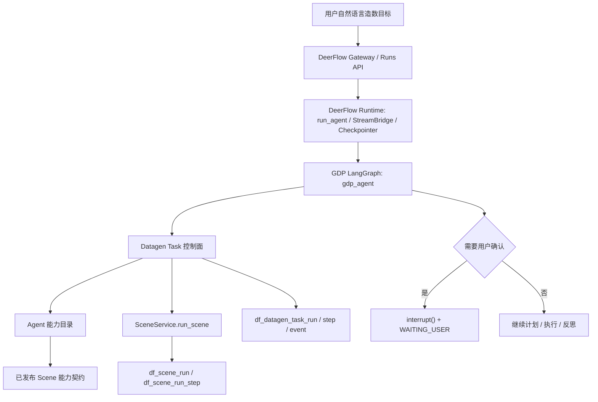

# 造数 Task Agent 实施计划

> **For agentic workers:** REQUIRED SUB-SKILL: Use superpowers:subagent-driven-development or superpowers:executing-plans to implement this plan task-by-task. Steps use checkbox (`- [ ]`) syntax for tracking.

**Goal:** 在 GDP datagen 中落地用户级造数 Task Agent，让用户用自然语言发起造数任务，Agent 优先复用已发布造数场景，能记录任务计划、步骤、事件、变量栈，并在需要用户确认时通过 LangGraph interrupt 从中断点继续执行。

**Architecture:** 采用 “DeerFlow Runtime + GDP 业务图” 的方式。DeerFlow 继续负责线程、SSE、Run 生命周期、checkpoint 和模型运行，GDP 新增独立的 Datagen Task 控制面和 `gdp_agent` LangGraph，用明确阶段约束工具可见性，把业务权威状态落到 Task 表。

**Tech Stack:** FastAPI、Pydantic、SQLAlchemy、LangChain、LangGraph `1.1.9`、DeerFlow Runtime、GDP datagen Scene/HTTP Source/SQL Source/Base Config。

---

## 1. 评审结论

外部实施路径的大方向是合理的：先做 Task 最小闭环，再做缺场景下探、Source 配置和基础配置；把 Task 领域状态和 LangGraph checkpoint 分开；通过阶段工具集限制 Agent 行为；用 `Command(resume=...)` 恢复 `interrupt()`。这些判断和 `task架构设计.md` 的总体设计一致。

但外部方案还不能直接照着实现，需要按本仓库代码事实修正：

1. `backend/app/gdp/datagen/config/task/` 目录已经存在，但 `api.py`、`models.py`、`repository.py`、`service.py`、`validation.py` 仍是空文件。计划应该是补全空壳目录，不是另起一套不受分层测试约束的新模块。
2. Scene 和 Source 的语义字段增强必须放在 Task 最小闭环之前。没有 `tags`、`capabilityType`、`semanticType`、`sideEffects` 等强语义契约，Agent 只能靠名称和备注猜测场景能力，最小闭环会变成不稳定演示。
3. 本地 LangGraph 是 `langgraph==1.1.9`，不能直接按最新文档里的 `stream_events(v3)` 或 `stream.interrupts` 设计。当前 DeerFlow worker 使用 `agent.astream(...)`，`interrupt()` 在 `values` chunk 中表现为 `__interrupt__`。
4. 当前 `RunCreateRequest.command` 字段已经存在，但 `backend/app/gateway/services.py:start_run()` 只处理 `body.input`，没有把 `body.command` 转成 LangGraph `Command` 输入。恢复闭环必须补上。
5. 当前 `resolve_agent_factory()` 总是返回 `make_lead_agent`。如果要运行 GDP 自定义图，必须给 `gdp_agent` 增加明确路由，并同步修改 `backend/tests/test_gateway_services.py` 中现有断言。
6. 写操作确认不能靠工具返回一句“需要确认”让 LLM 自己记住。必须是 Task 状态机和 LangGraph interrupt 的硬约束：写 TaskRun `WAITING_USER`、写事件、发业务流事件、checkpoint 挂起、用户回复后 `Command(resume=...)` 恢复。
7. 第一阶段不建议引入 `EXPLORE_CODEBASE`。造数 Task Agent 的主线是业务能力目录检索和场景执行，不是代码库探索。代码探索可以作为后续 Source 配置辅助能力，不应该污染 MVP。
8. GDP datagen API 只能用 GET/POST，新增 Task 和 Agent Catalog 接口不能设计 PUT/DELETE。
9. Datagen Pydantic 模型说明必须写中文类 docstring 和 `Field(description=...)`，代码注释也统一中文。

## 2. 当前代码事实

### 2.1 已有能力

- `backend/app/gdp/router.py` 已聚合 base、http source、sql source、scene 路由，但还没有 include task 路由。
- `backend/app/gdp/datagen/config/scene/service.py:run_scene()` 已固定读取已发布场景，并保存 `SceneExecutionResult`。
- `backend/app/gdp/datagen/config/scene/executor.py` 已按场景步骤拓扑执行 HTTP/SQL/ASSERT/TRANSFORM，并支持 `STOP_ON_ERROR`。
- `backend/app/gdp/datagen/config/scene/repository.py` 已有 `df_scene_run` 和 `df_scene_run_step`，Task 层应该引用 `sceneRunId`，不重复保存完整场景步骤事实。
- `backend/app/gdp/datagen/config/base/api.py`、`httpsource/api.py`、`sqlsource/api.py`、`scene/api.py` 已保持 GET/POST 风格。
- `backend/app/gdp/datagen/config/scene/validation.py` 已有语义质量 warning，但还只是提醒 `sceneRemark`、字段中文名、字段备注、输出映射。

### 2.2 缺失能力

- `backend/app/gdp/datagen/config/task/*.py` 为空，缺 Task 领域模型、表结构、服务、校验和 API。
- `backend/app/gdp/datagen/config/scene/models.py` 还没有完整的 Agent 能力契约字段，例如场景标签、业务能力类型、前置条件、副作用。
- `backend/app/gdp/datagen/config/httpsource/models.py` 和 `sqlsource/models.py` 还没有适合 Agent 检索的 Source 语义字段。
- `backend/app/gateway/services.py:resolve_agent_factory()` 目前所有 `assistant_id` 都映射到 `make_lead_agent`。
- `backend/app/gateway/services.py:start_run()` 当前忽略 `RunCreateRequest.command`。
- `backend/packages/harness/deerflow/runtime/runs/worker.py` 使用 `agent.astream(graph_input, config=runnable_config, stream_mode=...)`，并明确不通过 gateway 支持 `astream_events()`。

### 2.3 本地 LangGraph 版本约束

当前后端依赖实测为：

```text
langgraph==1.1.9
langchain==1.2.15
langchain-core==1.3.3
langgraph-checkpoint==4.0.2
langgraph-sdk==0.3.13
langgraph-api==0.8.1
```

实现上以本地版本为准：

- 恢复中断使用 `langgraph.types.Command(resume=...)`。
- 首次中断在 `astream(..., stream_mode="values")` 的 chunk 中出现 `__interrupt__`。
- 第一阶段不依赖 latest 文档里的 `stream_events(v3)`、`stream.interrupts`、`stream.interrupted`。
- GDP 自定义图的工厂签名建议为 `make_gdp_agent(config: RunnableConfig, app_config: AppConfig)`，这样 worker 可以把 `app_config` 注入进来。

## 3. 最终架构

### 3.1 分层



### 3.2 权威状态边界

| 层 | 保存什么 | 不保存什么 |
| --- | --- | --- |
| LangGraph checkpoint | 图跑到哪里、当前节点状态、interrupt 恢复点 | 业务审计真相 |
| Datagen Task 表 | 用户目标、计划、阶段、步骤、事件、变量栈、失败原因、总结 | LangGraph 内部调度细节 |
| Scene Run 表 | 已发布场景的一次执行事实和步骤执行事实 | 用户级任务计划 |
| Agent Prompt | 当前阶段必要摘要和候选理由 | 大 JSON 全量结果、全部配置表内容 |

### 3.3 第一阶段只做最小业务闭环

第一阶段目标是：

```text
用户自然语言
  -> 创建 TaskRun
  -> INTAKE 提取环境线索，无线索时兜底 envCode=DEV
  -> 搜索已发布场景能力契约
  -> 绑定入参
  -> 写操作确认
  -> 调用 SceneService.run_scene
  -> 记录 TaskStep / TaskEvent / sceneRunId
  -> 摘要化更新 VisibleVariables
  -> 反思任务是否完成
  -> 完成或失败总结
```

第一阶段暂不做：

- 自动设计新场景。
- 自动新增 HTTP Source 或 SQL Source。
- 自动新增系统、环境、服务端点、数据源。
- 批量造数。
- 向量检索。
- 代码库探索。

当没有现有场景可用时，第一阶段只记录 `RESOURCE_MISSING` 事件，并向用户说明缺少可用场景，建议进入场景设计分支。

## 4. 实施分期

### Phase 0：语义契约前置

**目标：** 让 Agent 搜索的是“能力契约”，不是数据库行名称。

**Files:**

- Modify: `backend/app/gdp/datagen/config/common/models.py`
- Modify: `backend/app/gdp/datagen/config/scene/models.py`
- Modify: `backend/app/gdp/datagen/config/scene/repository.py`
- Modify: `backend/app/gdp/datagen/config/scene/validation.py`
- Modify: `backend/app/gdp/datagen/config/httpsource/models.py`
- Modify: `backend/app/gdp/datagen/config/httpsource/repository.py`
- Modify: `backend/app/gdp/datagen/config/sqlsource/models.py`
- Modify: `backend/app/gdp/datagen/config/sqlsource/repository.py`
- Test: `backend/tests/test_scene_custom_snapshots.py`
- Test: `backend/tests/test_datagen_layering.py`

**新增或调整字段建议：**

- Scene:
  - `tags: list[str]`
  - `capabilityType: Literal["CREATE", "UPDATE", "QUERY", "ASSERT", "COMPOSITE"]`
  - `businessDomain: str | None`
  - `preconditions: list[CapabilityCondition]`
  - `sideEffects: list[CapabilitySideEffect]`
  - `agentDescription: str | None`
- Input / result field metadata:
  - `semanticType: str | None`
  - `aliases: list[str]`
  - `exampleValue: Any | None`
- HTTP Source:
  - `tags`
  - `businessDomain`
  - `capabilityType`
  - `sideEffects`
  - `agentDescription`
- SQL Source:
  - `tags`
  - `businessDomain`
  - `capabilityType`
  - `sideEffects`
  - `agentDescription`

**步骤：**

- [ ] 为新增模型写 Pydantic 中文 docstring 和 `Field(description=...)`。
- [ ] 在 repository 中新增列或 JSON 字段，开发期允许破坏性表结构变更。
- [ ] 更新 Scene 发布校验：发布时强制核心语义字段完整，草稿阶段只 warning。
- [ ] 更新已有 snapshot / repository 测试，确保语义字段保存、读取、版本快照稳定。
- [ ] 更新 `test_datagen_layering.py` 的表注册断言。

**验收：**

```text
uv run pytest tests/test_datagen_layering.py tests/test_scene_custom_snapshots.py -q
```

### Phase 1：Task 控制面

**目标：** 建立用户级造数任务的领域事实层。

**Files:**

- Modify: `backend/app/gdp/datagen/config/task/models.py`
- Modify: `backend/app/gdp/datagen/config/task/repository.py`
- Modify: `backend/app/gdp/datagen/config/task/service.py`
- Modify: `backend/app/gdp/datagen/config/task/validation.py`
- Modify: `backend/app/gdp/datagen/config/task/api.py`
- Modify: `backend/app/gdp/router.py`
- Modify: `backend/packages/harness/deerflow/persistence/models/__init__.py`
- Modify: `backend/tests/test_datagen_layering.py`
- Create: `backend/tests/test_datagen_task_service.py`
- Create: `backend/tests/test_datagen_task_api.py`

**数据表：**

- `df_datagen_task_run`
- `df_datagen_task_step`
- `df_datagen_task_event`

**核心模型：**

- `DatagenTaskStatus`
- `DatagenTaskPhase`
- `DatagenTaskStepType`
- `DatagenTaskRunCreateRequest`
- `DatagenTaskRunResponse`
- `DatagenTaskStepResponse`
- `DatagenTaskEventResponse`
- `DatagenTaskPlan`
- `DatagenTaskPlanStep`
- `VisibleVariable`
- `VisibleVariableValueSummary`
- `GoalStackItem`
- `DatagenTaskUserReplyRequest`
- `DatagenTaskContinueResponse`

**状态建议：**

```text
PLANNING
RUNNING
WAITING_USER
COMPLETED
FAILED
CANCELLED
```

**阶段建议：**

```text
INTAKE
SCENE_FULFILLMENT
SCENE_EXECUTING
PROGRESS_REFLECTION
SCENE_DESIGN
SOURCE_CONFIG
INFRA_CONFIG
WAITING_USER
COMPLETED
FAILED
```

**API 只能 GET/POST：**

```text
GET  /api/v1/datagen/tasks/runs
GET  /api/v1/datagen/tasks/runs/{taskRunId}
POST /api/v1/datagen/tasks/runs
POST /api/v1/datagen/tasks/runs/{taskRunId}/continue
POST /api/v1/datagen/tasks/runs/{taskRunId}/cancel
POST /api/v1/datagen/tasks/runs/{taskRunId}/user-reply
GET  /api/v1/datagen/tasks/runs/{taskRunId}/steps
GET  /api/v1/datagen/tasks/runs/{taskRunId}/events
GET  /api/v1/datagen/tasks/runs/{taskRunId}/summary
```

**Service 方法建议：**

- `create_task_run(...)`
- `get_task_run(...)`
- `list_task_runs(...)`
- `record_event(...)`
- `start_step(...)`
- `complete_step(...)`
- `fail_step(...)`
- `mark_waiting_user(...)`
- `record_user_reply(...)`
- `mark_completed(...)`
- `mark_failed(...)`
- `append_visible_variables_from_scene_result(...)`
- `get_prompt_visible_variables(...)`

**关键规则：**

- INTAKE 阶段先从自然语言提取环境线索，例如“测试服”“生产”“预发”“DEV”。只有当模型明确判断用户没有提供环境线索时，后端才兜底 `envCode = "DEV"`，并写 `DEFAULT_ENV_SELECTED` 事件。
- 环境提取结果要保存来源：`USER_EXPLICIT` 表示用户明确或隐式提及，`SYSTEM_DEFAULT` 表示后端默认。后续执行、确认文案和审计事件都要带上该来源，避免硬编码默认值覆盖用户意图。
- VisibleVariables 落库可以保留全量值，但注入 Agent 只给 `valueSchema`、`valuePreview`、`valueSize`。
- 业务错误终止整个 Task，不由 Task 层默认重试。
- Task 历史必须能从 `WAITING_USER` 后继续。

**验收：**

```text
uv run pytest tests/test_datagen_layering.py tests/test_datagen_task_service.py tests/test_datagen_task_api.py -q
```

### Phase 2：Agent Catalog 和场景执行工具

**目标：** 给 Agent 提供小而确定的业务工具，先只支持搜索和执行已有已发布场景。

**Files:**

- Create: `backend/app/gdp/datagen/agent_catalog/__init__.py`
- Create: `backend/app/gdp/datagen/agent_catalog/models.py`
- Create: `backend/app/gdp/datagen/agent_catalog/service.py`
- Create: `backend/app/gdp/datagen/agent_catalog/api.py`
- Modify: `backend/app/gdp/router.py`
- Create: `backend/app/gdp/agent/tools/__init__.py`
- Create: `backend/app/gdp/agent/tools/scene_tools.py`
- Create: `backend/app/gdp/agent/tools/task_tools.py`
- Create: `backend/tests/test_datagen_agent_catalog.py`
- Create: `backend/tests/test_gdp_agent_scene_tools.py`

`agent_catalog` 是面向 Agent 的只读能力目录，不放在 `config/` 层里。它可以读取 scene、http source、sql source、base config 的摘要并生成候选评分，但不直接负责配置写入。

依赖注入上，`AgentCatalogService` 可以组合只读 repository，例如 `SceneRepository`、`HttpSourceRepository`、`SqlSourceRepository`、`BaseConfigRepository`。这是允许的跨模块读取，因为 Catalog 是上层 read model；反向依赖禁止出现，scene/http/sql/base/task 模块不能 import `agent_catalog`，避免形成循环依赖。

**Catalog API：**

```text
POST /api/v1/datagen/agent/catalog/scenes/search
GET  /api/v1/datagen/agent/catalog/scenes/{sceneCode}/contract
```

**场景搜索返回必须包含：**

- 候选场景。
- 多因子评分。
- 选择理由。
- 未满足入参。
- 是否有写操作或副作用。
- 是否已发布可执行。

**第一阶段评分因子：**

- `sceneName`、`sceneRemark`、`agentDescription` 文本匹配。
- `tags`、`businessDomain`、别名字典匹配。
- `capabilityType` 是否符合目标动作。
- `resultSchema.semanticType` 是否覆盖目标产出。
- `inputSchema.semanticType` 是否能从用户输入或变量栈绑定。
- `sideEffects` 是否符合目标，并触发确认。

**工具：**

- `get_datagen_task_state`
- `search_scene_contracts`
- `get_scene_contract`
- `bind_scene_inputs`
- `run_datagen_scene_for_task`
- `reflect_scene_result`

**关键规则：**

- 工具内部调用 `TaskService` 和 `SceneService`，不要让 LLM 直接碰 repository 或 executor。
- `run_datagen_scene_for_task` 负责记录 TaskStep、TaskEvent、`sceneRunId` 和变量栈摘要。
- 如果场景执行结果是 `FAILED` 或 `PARTIAL`，Task 层按业务失败终止。

**验收：**

```text
uv run pytest tests/test_datagen_agent_catalog.py tests/test_gdp_agent_scene_tools.py -q
```

### Phase 3：接入 DeerFlow Runtime 和 gdp_agent

**目标：** 让 `/api/threads/{thread_id}/runs` 可以通过 `assistant_id="gdp_agent"` 启动 GDP 自定义图。

**Files:**

- Create: `backend/app/gdp/agent/__init__.py`
- Create: `backend/app/gdp/agent/state.py`
- Create: `backend/app/gdp/agent/graph.py`
- Create: `backend/app/gdp/agent/nodes/intake.py`
- Create: `backend/app/gdp/agent/nodes/scene_fulfillment.py`
- Create: `backend/app/gdp/agent/nodes/progress_reflection.py`
- Create: `backend/app/gdp/agent/nodes/human_confirm.py`
- Create: `backend/app/gdp/agent/prompts.py`
- Modify: `backend/app/gateway/services.py`
- Modify: `backend/tests/test_gateway_services.py`
- Create: `backend/tests/test_gdp_agent_graph.py`

**Graph 工厂：**

```python
def make_gdp_agent(config: RunnableConfig, app_config: AppConfig):
    ...
```

**GDPState 尽量保持小：**

- `messages`
- `task_run_id`
- `user_intent`
- `env_code`
- `current_phase`
- `pending_confirmation`
- `last_tool_result`

不要把大 JSON 场景结果直接塞进 GDPState。大值进入 Task 表，Prompt 只取摘要。

**gateway 修改点：**

- `resolve_agent_factory("gdp_agent")` 返回 `make_gdp_agent`。
- 其他自定义 assistant 仍可保持现有 `make_lead_agent + agent_name` 模式。
- `build_run_config()` 对 `gdp_agent` 不应注入会误导 Lead Agent 的 `agent_name`，或者要明确约定 GDP 图是否需要该字段。
- 同步更新现有 `test_resolve_agent_factory_returns_make_lead_agent`，拆成 lead/custom lead/GDP 三类断言。

**Graph MVP 拓扑：**

```text
START
  -> intake
  -> scene_fulfillment
  -> maybe_human_confirm
  -> scene_execute
  -> progress_reflection
  -> completed | failed | scene_fulfillment
```

**INTAKE 环境识别：**

- `nodes/intake.py` 的 Prompt 必须要求模型抽取环境倾向，输出 `envCodeCandidate`、`envMentioned`、`confidence`、`reason`。
- `envMentioned=false` 时才调用 TaskService 兜底 `DEV`。
- 如果用户说“测试服”“测试环境”，但基础配置中没有直接叫 `TEST` 的环境，INTAKE 只记录用户环境线索，后续通过 Agent Catalog 或基础配置解析映射到实际 `envCode`。
- 如果用户提到“生产”，写操作确认文案必须更严格，第一阶段可以先要求用户二次确认，不自动执行。

**验收：**

```text
uv run pytest tests/test_gateway_services.py tests/test_gdp_agent_graph.py -q
```

### Phase 4：interrupt 和用户确认恢复闭环

**目标：** 写操作场景执行前必须等待用户确认，并能从中断点继续执行。

**Files:**

- Modify: `backend/app/gateway/services.py`
- Modify: `backend/app/gateway/routers/thread_runs.py`
- Modify: `backend/app/gateway/routers/runs.py`
- Modify: `backend/app/gdp/datagen/config/task/service.py`
- Modify: `backend/app/gdp/datagen/config/task/api.py`
- Modify: `backend/app/gdp/agent/nodes/human_confirm.py`
- Create: `backend/tests/test_gateway_command_resume.py`
- Create: `backend/tests/test_gdp_task_interrupt_resume.py`

**关键实现：**

- `RunCreateRequest.command` 已存在，`start_run()` 必须支持：

```python
from langgraph.types import Command

if body.command:
    graph_input = Command(**body.command)
else:
    graph_input = normalize_input(body.input)
```

第一阶段采用单点业务阻塞，前端 `user-reply` 不要求携带 LangGraph 原生 `interrupt_id`。`TaskService` 根据 `taskRunId` 找到当前绑定的 `deerflowThreadId` 和 pending interrupt，构造普通 `Command(resume=user_reply_payload)` 重新提交到同一 thread。在 `langgraph==1.1.9` 下，单个挂起点通常会由该 resume 值唤醒最近的 interrupt。

如果未来支持并行 HITL 或一个 checkpoint 内多个 interrupt，不能继续只传普通值，需要改成按 interrupt id 的 resume map：

```python
Command(resume={
    "interrupt_id_1": user_reply_1,
    "interrupt_id_2": user_reply_2,
})
```

第一阶段不要做并行 HITL；多个业务问题要聚合成一个确认 payload。

- `human_confirm` 节点调用 `interrupt(payload)` 前先执行：
  - `TaskRun.status = WAITING_USER`
  - `TaskRun.phase = WAITING_USER`
  - 保存 `pendingInterruptsJson`
  - 写 `DatagenTaskEvent(eventType="ASK_USER")`
  - 通过 custom stream 发 `gdp_waiting_user`

- 用户回复 API 做两件事：
  - 写 `USER_REPLY` 事件。
  - 向同一个 `deerflowThreadId` 提交 `Command(resume=...)`，而不是只更新数据库。

**建议第一阶段只支持单个业务中断：**

```json
{
  "taskRunId": "task_001",
  "phase": "SCENE_EXECUTING",
  "questionType": "WRITE_SCENE_APPROVAL",
  "question": "是否执行会写入数据的创建订单场景？",
  "details": {
    "sceneCode": "create_order",
    "envCode": "DEV",
    "sideEffects": ["CREATE_ORDER"]
  }
}
```

**验收：**

```text
uv run pytest tests/test_gateway_command_resume.py tests/test_gdp_task_interrupt_resume.py -q
```

### Phase 5：端到端最小闭环

**目标：** 跑通“帮我造一笔已支付订单”这类任务，前提是已有可用已发布场景。

**Files:**

- Create: `backend/tests/test_gdp_task_agent_e2e.py`
- 根据前端需要再新增 Task 页面或接入现有对话入口。

**端到端断言：**

- 创建 TaskRun。
- 默认环境为 `DEV`。
- 搜索到已发布场景。
- 如果场景有写操作，Task 进入 `WAITING_USER`。
- 用户确认后通过 `Command(resume=True)` 恢复。
- 调用 `SceneService.run_scene`。
- TaskStep 保存 `sceneRunId`。
- TaskEvent 记录候选、选择、确认、执行、变量栈更新、完成。
- TaskRun 最终 `COMPLETED`。
- 最终总结包含执行了哪些场景、关键产出变量和环境。

**验收：**

```text
uv run pytest tests/test_gdp_task_agent_e2e.py -q
```

## 5. 后续分支计划

### Phase 6：缺场景进入场景设计

缺少可用场景时，不应该 Task 失败，而是进入资源缺口状态：

- 搜索 Source 能力契约。
- 如果 Source 足够，生成 `SceneDefinition` 草稿。
- 校验 DAG、入参绑定和结果映射。
- 校验通过后允许自动发布新场景。
- 新场景如有写操作，首次执行前仍必须用户确认。

新增接口：

```text
POST /api/v1/datagen/agent/catalog/sources/search
POST /api/v1/datagen/agent/scenes/draft
POST /api/v1/datagen/agent/scenes/validate
POST /api/v1/datagen/agent/scenes/publish
```

### Phase 7：缺 Source 进入 HTTP/SQL 配置

场景设计发现缺 HTTP/SQL 原子能力时，再进入 Source 配置阶段：

- HTTP 工具只处理接口配置、测试、输出映射。
- SQL 工具只处理 SQL 解析、参数识别、安全策略、测试、输出字段。
- Agent 不能在 Source 阶段直接写基础配置，必须先调用基础配置解析工具判断缺口。

工具建议：

- `resolve_http_source_basis`
- `upsert_http_source_from_agent`
- `test_http_source_from_agent`
- `resolve_sql_source_basis`
- `parse_sql_source_from_agent`
- `upsert_sql_source_from_agent`
- `test_sql_source_from_agent`

### Phase 8：缺基础配置进入 Infra 配置

只有当 Source 配置缺系统、环境、服务端点、数据源时，才进入基础配置阶段。

基础匹配不是关键词命中，而是：

```text
LLM 提取业务线索
  -> 别名字典扩展
  -> SQL 多字段检索
  -> 多因子评分
  -> 返回候选、置信度、缺口和理由
```

处理规则：

| 匹配结果 | 处理 |
| --- | --- |
| 高置信度且无缺口 | 自动采用，写选择理由事件 |
| 多候选或中置信度 | 进入用户确认 |
| 低置信度 | 询问用户补充系统、环境或数据源信息 |
| 无命中 | 引导新增基础配置 |
| 命中系统但缺 `DEV` 服务端点 | 引导配置服务端点 |
| 命中系统但缺 `DEV` 数据源 | 引导配置数据源 |

工具建议：

- `resolve_infra_basis`
- `upsert_system_from_agent`
- `upsert_environment_from_agent`
- `upsert_service_endpoint_from_agent`
- `upsert_datasource_from_agent`

## 6. 测试总计划

优先补这些测试，避免 Agent 逻辑变成纯手工验收：

1. `tests/test_datagen_layering.py`
   - 新 Task ORM 行注册到 `Base.metadata`。
   - datagen 分层依赖不倒挂。
2. `tests/test_datagen_task_service.py`
   - 创建任务默认 `DEV`。
   - 记录事件、步骤、变量栈。
   - 业务失败终止。
   - VisibleVariables 摘要化。
3. `tests/test_datagen_agent_catalog.py`
   - 场景候选评分。
   - 别名扩展。
   - 入参可绑定判断。
   - 写操作识别。
4. `tests/test_gateway_command_resume.py`
   - `RunCreateRequest.command` 被转为 `Command(resume=...)`。
   - `body.input` 和 `body.command` 的优先级明确。
   - 单点阻塞下，`Command(resume=user_reply)` 能恢复最近挂起节点。
   - 覆盖同一 `thread_id` 的多轮交互：第一次 interrupt/resume 完成后，第二次 interrupt/resume 仍能恢复正确 checkpoint。
5. `tests/test_gdp_agent_graph.py`
   - `gdp_agent` 工厂签名支持 `app_config`。
   - Graph 在无场景时记录资源缺口。
   - Graph 在有场景时进入执行分支。
6. `tests/test_gdp_task_interrupt_resume.py`
   - 写操作前 `WAITING_USER`。
   - 用户回复后恢复 checkpoint 并继续执行。
7. `tests/test_gdp_task_agent_e2e.py`
   - 完整自然语言任务调用已有场景完成。

每个阶段完成后至少运行对应阶段测试。阶段一到四完成后建议运行：

```text
uv run pytest tests/test_datagen_layering.py tests/test_gateway_services.py tests/test_datagen_task_service.py tests/test_datagen_agent_catalog.py tests/test_gdp_agent_graph.py tests/test_gateway_command_resume.py -q
```

## 7. 风险和处理策略

### 7.1 LangGraph 文档和本地版本不一致

风险：按 latest 文档写 `stream_events(v3)` 会和本地 `langgraph==1.1.9`、DeerFlow worker 不匹配。

策略：第一阶段只基于 `agent.astream(..., stream_mode="values" | "custom")`、`__interrupt__`、`Command(resume=...)` 实现。升级 LangGraph 另立 Runtime 改造任务。

### 7.2 Prompt 上下文膨胀

风险：场景返回大 JSON 后塞入变量栈，后续 Prompt 快速超限。

策略：TaskService 写入变量时同步生成 `valueSchema`、`valuePreview`、`valueSize`，Prompt 默认只注入摘要。读取全量值必须通过确定性工具按引用读取。

### 7.3 Agent 误调用深层工具

风险：用户只是要造数，Agent 一开始就查系统、数据源、HTTP 接口，导致跑偏。

策略：GDP Graph 按 phase 绑定工具。`SCENE_FULFILLMENT` 只能搜场景和执行场景；只有缺场景才进入 `SCENE_DESIGN`；只有缺 Source 才进入 `SOURCE_CONFIG`；只有 Source 基础不足才进入 `INFRA_CONFIG`。

### 7.4 写操作绕过确认

风险：场景或 Source 标识不完整，Agent 执行写操作前没有确认。

策略：写操作确认不只依赖 Agent 判断。Scene/Source 语义字段必须声明 `capabilityType` 和 `sideEffects`；TaskService 在执行前二次校验，发现写操作且未确认就强制进入 `WAITING_USER`。

### 7.5 Task 表和 checkpoint 状态不一致

风险：数据库显示等待用户，但 LangGraph checkpoint 没有可恢复 interrupt，或反过来。

策略：`interrupt()` 前先写 Task 状态和事件；`user-reply` 恢复前检查 TaskRun 绑定的 `deerflowThreadId` 和 pending interrupt；恢复失败要写 `RESUME_FAILED` 事件，不能只返回 500。

### 7.6 Scene 业务错误和资源缺失混淆

风险：场景执行业务失败后 Agent 继续尝试别的场景，造成更多脏数据。

策略：场景执行返回业务失败时 Task 直接 `FAILED`。只有“没有可用场景或配置缺失”才进入下探分支。

## 8. 推荐落地顺序

1. 先做 Phase 0 语义字段增强，否则 Agent 检索没有可靠基础。
2. 再做 Phase 1 Task 领域模型和 API，让业务状态先可审计。
3. 再做 Phase 2 Agent Catalog 和 scene tools，用确定性服务包装 LLM 工具。
4. 再做 Phase 3 `gdp_agent` 路由和最小图，打通 DeerFlow Runtime。
5. 再做 Phase 4 interrupt/resume，保证写操作确认和历史恢复。
6. 最后做 Phase 5 端到端闭环。

这个顺序的核心原则是：先让业务事实可靠，再让 Agent 决策；先能复用已有场景，再让 Agent 设计新资源；先保证恢复和审计，再扩大自动化范围。
